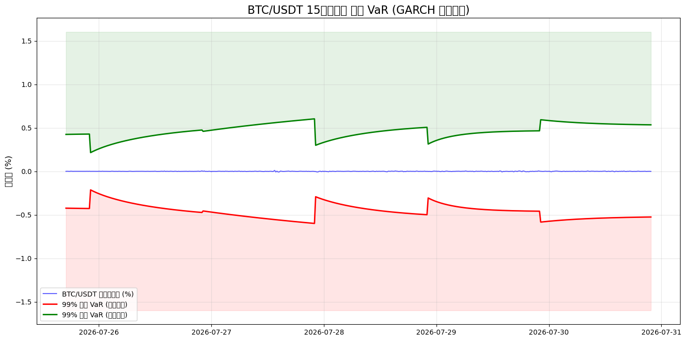
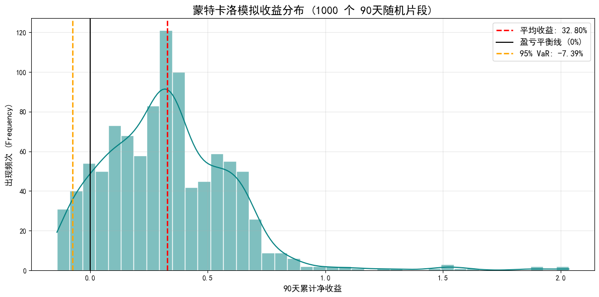

# BTC 15分钟波动率突破策略研究

用 GARCH 动态波动率 + XGBoost + 三重屏障标签，研究 BTC/USDT 永续合约在 15 分钟 K 线上是否存在可交易的短周期 alpha。这是一份完整的量化研究记录：数据管道、统计检验、建模、回测、稳健性压力测试，以及最后对结果的诚实复盘。

## 一句话结论

**在当前这套方法（纯 OHLCV 衍生特征 + XGBoost + GARCH 动态屏障）下，没有找到经得起"真实执行成本"检验的正期望。** 早期版本的回测（年化 182%、Calmar 8.68）建立在偏乐观的成交假设上；把成交判定换成用 K 线的 high/low 真实触碰、并加入触碰滑点这类更贴近实盘的执行细节后，同一策略的年化收益变成 **-0.75% ~ -3.6%**（见下方"结果演进"）。这不是说加密货币短周期完全不可预测，而是这一批特征、这一套方法论，在这个频段上，信息含量已经接近天花板。详见文末的"诚实复盘"。

## 方法论流水线

```
OKX 历史 15m OHLCV
      │
      ▼
ADF 平稳性检验 + ARCH-LM 效应检验   ← 判断"该不该上 GARCH"的前置检验
      │
      ▼
滚动窗口 GARCH(1,1)                ← 每个时刻的波动率预测只用它之前的数据拟合，无未来函数
      │
      ▼
特征工程（技术指标 + GARCH衍生 + 趋势/regime特征）
      │
      ▼
三重屏障标签（屏障宽度 = GARCH VaR 的动态倍数）
      │
      ▼
Walk-forward 训练 XGBoost           ← 滚动切窗口，每个窗口只用它之前的数据训练
      │
      ▼
波动率突破策略回测（含滑点/手续费/移动止损）
      │
      ▼
1000 次蒙特卡洛压力测试              ← 用分布而不是单条曲线评估稳健性
```

每一步都刻意避免"未来偷看过去"：GARCH 是滚动样本外预测，XGBoost 是 walk-forward 训练，回测里手续费、滑点、盘中真实触碰都被显式建模。

## 结果演进（诚实复盘的核心）

这是这份研究里最有价值的部分：同一个策略框架，随着执行假设越来越贴近真实交易，结果如何变化。

| 阶段 | 成交价假设 | 年化收益 / 90天蒙特卡洛均值 |
|---|---|---|
| 初版回测 | 理论屏障价直接成交，只用收盘价判断触碰 | CAGR 182.43%，Calmar 8.68 |
| 1000次蒙特卡洛压力测试（同一假设） | 同上 | 90天均值 +32.80%，95% VaR -7.39% |
| **最终修正版**（本仓库 `src/strategy.py`） | 用 high/low 判断真实触碰 + 触碰滑点 + 下单滑点 | **年化 -0.75% ~ -3.6%**（不同 trail_mult 参数下） |

> 完整数据见 `notebooks/research_exploration.ipynb` 对应 cell。第一行数字好看，是因为它假设你总能精确地在理论屏障价成交——这在真实盘口里几乎不可能；第三行是把这个假设拿掉之后的结果，也是更值得相信的数字。


*滚动 GARCH 预测的样本外波动率与 99% VaR（防暴涨/防暴跌两条动态防线）*


*1000 次随机 90 天片段回测的收益分布（对应上表"初版假设"下的结果）*

## 诚实复盘：这套方法测试得够不够彻底？

原始 notebook 结尾的判断（保留在 `notebooks/research_exploration.ipynb` 最后一个 markdown cell）：

- **这套方法本身已经被排查得比较彻底**：三种标签定义（方向/突破）、多组特征（技术指标/regime/资金费率）、多种回测执行假设（理论价→收盘价→高低点真实触碰）、大范围参数扫描（阈值/止盈止损/追踪距离/持仓时长），每一条能想到的路径都试过，而且每次深挖都发现之前的"好消息"建立在某个不成立的假设上。
- **但"这套方法没用"不等于"这个市场没有任何可预测性"**：所有特征本质上都来自同一份 OHLCV 衍生数据，彼此高度相关；资金费率、持仓量这类衍生品特有信息因为 OKX API 历史只有约 3 个月，样本量太小，严格说是"未完成"而不是"已证伪"；15分钟到3小时这个频段恰好是做市商/高频/套利机器人竞争最激烈的区域。
- 结论：没有为了让结果好看而选择性展示某个版本，最终交付的 `src/strategy.py` 是那个诚实的、执行假设最贴近真实的版本，即便它的回测结果是负的。

## 仓库结构

```
.
├── notebooks/
│   └── research_exploration.ipynb   # 完整探索过程（已清理密钥），包含所有中间尝试和图表
├── src/
│   ├── config.py        # 全局参数（密钥从环境变量读取，不硬编码）
│   ├── data_fetch.py     # OKX历史数据抓取
│   ├── diagnostics.py    # ADF / ARCH-LM 检验
│   ├── garch_vol.py      # 滚动窗口 GARCH 样本外波动率与 VaR
│   ├── features.py       # 特征工程
│   ├── labeling.py       # 三重屏障标签
│   ├── model.py           # Walk-forward XGBoost 训练
│   ├── strategy.py        # 最终版波动率突破策略（回测引擎）
│   ├── stress_test.py     # 蒙特卡洛压力测试
│   └── pipeline.py        # 串起以上所有步骤的端到端流水线
├── results/                # 关键图表
├── requirements.txt
├── .env.example
└── .gitignore
```

`notebooks/research_exploration.ipynb` 是原始探索记录（保留了走过的弯路、修过的 bug、试过又放弃的方向），`src/` 是从中提炼出的、去重后的最终版本代码。想看"怎么一步步得出这个结论的"看 notebook，想看"能直接复用的干净代码"看 `src/`。

## 怎么跑起来

```bash
pip install -r requirements.txt
cp .env.example .env   # 纯回测不需要改这个文件；只有要抓鉴权接口数据时才需要填 OKX key
```

```python
from src.data_fetch import build_public_exchange, fetch_large_ohlcv_okx
from src.pipeline import build_final_dataset
from src.strategy import build_default_strategy
from src.stress_test import run_stress_test, summarize_stress_test

exchange = build_public_exchange()
df_raw = fetch_large_ohlcv_okx(exchange, symbol="BTC/USDT", timeframe="15m", target_limit=50000)

df_final = build_final_dataset(df_raw)          # 较耗时：滚动GARCH + walk-forward训练
strategy = build_default_strategy()
trades = strategy.run_backtest(df_final)

stress_results = run_stress_test(df_final, strategy, n_samples=200, segment_days=90)
print(summarize_stress_test(stress_results))
```

## 已知局限 / 后续方向

- 资金费率、持仓量比这类衍生品特有信息因为交易所 API 历史数据只有约 3 个月，没能得出统计显著的结论，是明确标注为"未完成"的方向。
- 15分钟这个频段本身竞争激烈，后续更值得尝试拉长到 1 小时甚至更长周期，用信噪比换稳定性。
- `notebooks/research_exploration.ipynb` 里有一处代码坏味道值得说明：探索过程中出现过一个只存在于当时 Jupyter 内核内存、没有被保存进 `.ipynb` 文件的中间类（`VolatilityBreakoutStrategy_Mid`）。打包时已经在 `src/strategy.py` 里把它和它的最终子类合并重建为一个自洽、可独立运行的版本，并在代码注释里说明了原委。

## 关于密钥

早期探索版本里 OKX 的 API key/secret/密码是硬编码在 notebook 里的，已经在打包前作废并重新生成，现在 `notebooks/research_exploration.ipynb` 和 `src/` 里都不含任何真实凭证——所有凭证通过环境变量（`.env`，已在 `.gitignore` 里）读取，且本项目实际用到的抓数据逻辑本身也不需要鉴权。
