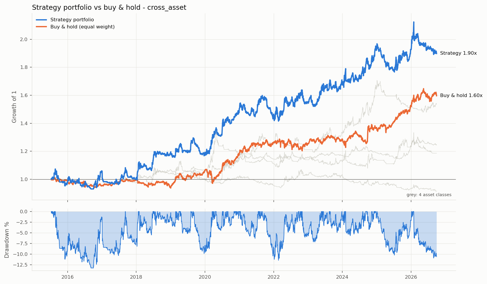
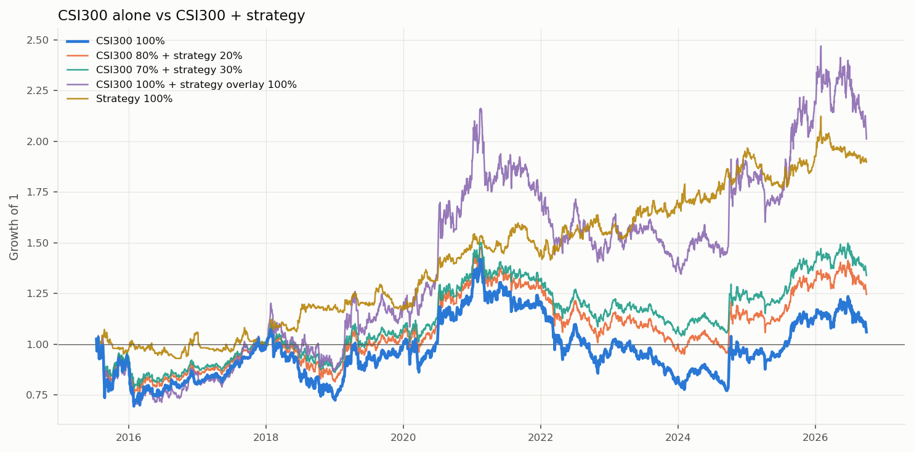
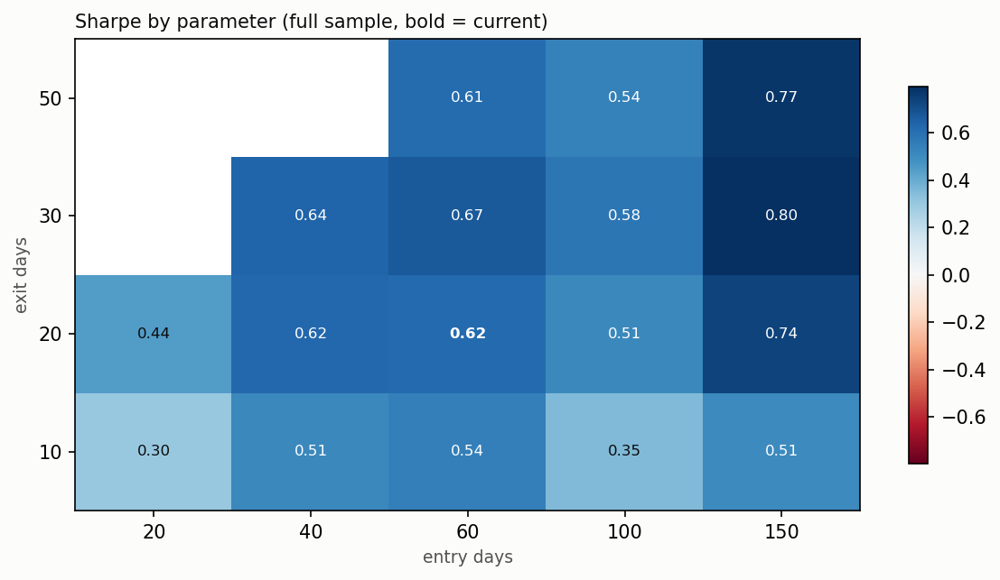

# Quant Research

**中文** | [English](#english)

跨资产趋势跟踪策略研究 + 一套可复用的分层回测框架（Python）。

在国内股指、国债、商品期货和外汇共 26 个品种上复现并扩展 Moskowitz, Ooi & Pedersen (2012) 的时间序列动量（TSMOM），重点不在"调出一条漂亮曲线"，而在**避免前视偏差、识别过拟合、诚实评估结果**。

---

## 主要结果

回测区间 2015-07 ~ 2026-09，日线，唐奇安通道 60/20，组合按类别两层等权并缩放到 10% 年化波动。



| | 年化收益 | 年化波动 | 夏普 | 最大回撤 | Calmar |
|---|---:|---:|---:|---:|---:|
| **趋势策略组合** | **+5.9%** | 10.0% | **0.62** | **-13.3%** | 0.44 |
| 同品种等权买入持有 | +4.3% | 6.4% | 0.68 | -9.4% | 0.45 |

| 资产类别 | 夏普 | 最大回撤 |
|---|---:|---:|
| 国债 | 0.73 | -13.4% |
| 商品 | 0.53 | -7.5% |
| 股指 | 0.31 | -12.5% |
| 外汇 | -0.18 | -15.0% |

- **α 显著**：相对买入持有的 CAPM α 为月均 0.51%（Newey-West t = 2.39），β ≈ 0
- **危机中赚钱**：对基准收益平方项回归 t = 3.50（TSMOM 的 "smile"）；2020 年疫情 +11%、2022 年加息 +12%，同期买入持有分别 -9%、-5%
- **分散化**：跨类别品种两两相关性平均 0.02
- **统计显著性**：20 天分块自助法，夏普 95% 置信区间 [0.04, 1.20]

### 和沪深300 组合：这个策略有什么用



| 组合 | 年化收益 | 夏普 | 最大回撤 |
|---|---:|---:|---:|
| 沪深300 100% | +0.5% | 0.13 | -45.6% |
| 沪深300 80% + 策略 20% | +2.0% | 0.20 | -35.7% |
| 沪深300 70% + 策略 30% | +2.6% | 0.25 | -30.7% |
| 沪深300 50% + 策略 50% | +3.8% | 0.39 | -20.3% |

策略与沪深300 月度相关性 -0.01。加入策略后夏普上升、最大回撤减半，这是趋势策略的主要价值。（沪深300 为价格指数，未含约 2%/年的分红。）

### 稳定性检验



- **过拟合识别**：样本内（2015–2021）最优参数 60/10 夏普 0.73，到样本外（2022–）只剩 0.30；入场 150 天、出场 30–50 天的组合在样本内外都排在前列，出场窗口越短样本外衰减越多
- **成本修正**：统一按 3 个基点计滑点会把国债期货成本高估约十倍；改为按最小变动价位计算后，组合夏普从 0.50 升至 0.62，滑点放大 4 倍夏普仍有 0.48
- **信号对比**：唐奇安、TSMOM、均线交叉夏普都在 0.5–0.7，相互相关 0.5–0.7；多周期混合样本外夏普 0.70
- **过滤器**：GARCH 和 VIX 过滤都略微提高夏普，但二者逻辑相反，更可能是噪音，未纳入正式策略
- **外汇失效**：2000–2014 年外汇趋势组合夏普 0.62，2015 年后接近 0；方差比显示非人民币货币对转为均值回复

---

## 回测框架

```
backtest/
├── markets.py      第 1 层 数据接口: "市场:代码" → K线; 各市场交易规则 (手续费、按最小变动价位的滑点、合约乘数、涨跌停)
├── signals.py      第 2 层 信号: donchian / tsmom / ma / 多周期混合, 字符串切换; 可加载自定义信号
├── filters.py      第 3 层 过滤: GARCH (滚动估计) / VIX (中国 QVIX、美国 VIX 滞后一天)
├── engine.py       执行: 1% 风险 / ATR 定仓位、止损跳空、滑点、逐根盯市
├── portfolio.py    第 4 层 组合: 跨资产 / 跨周期, 两层等权, 事前波动率目标化
├── robustness.py   第 5 层 稳定性: 信号 / 过滤器对比、参数网格、样本内外、分块自助法、成本敏感性
├── overlay.py      与沪深300 组合分析
└── report.py       第 6 层 报告: Markdown + 图表
```

**处理过的偏差**

- 期货连续合约：用前一天收盘的持仓量决定换月；信号用复权价，手数、手续费、盈亏用当时真实价格
- 股票：后复权（未来分红不改写历史）
- GARCH 滚动重估、VIX 按时区对齐、目标波动率用前一天的估计 —— 均通过截断测试验证无前视
- 权益逐根盯市（只在平仓时记账会把 BTC 4h 策略的回撤从 24% 低估成 12%）

**运行**

```bash
pip install -r requirements.txt
python -m backtest strategies/turtle/configs/cross_asset.toml
python -m backtest strategies/turtle/configs/cross_asset.toml --signal tsmom:252 --filter vix:low,80
```

新策略只需写一个信号类和一份配置文件，见 [`backtest/README.md`](backtest/README.md) 和 [`strategies/_template/`](strategies/_template/)。

数据来源：新浪期货单月合约、东方财富外汇（AKShare）、CSMAR（A股，因版权不随仓库提供）、OKX（加密货币）、FRED（VIX）。

---

## 目录

| 路径 | 内容 |
|---|---|
| `backtest/` | 分层回测框架 |
| `data/` | 取数、缓存、复权 |
| `strategies/turtle/` | 趋势策略：回测配置、实盘信号、看盘 |
| `strategies/_template/` | 新策略模板 |
| `strategies/15min_garch/` | BTC 15 分钟 GARCH + XGBoost 方向预测（结论：方向 alpha 不成立） |
| `strategies/ff3/` | A股 Fama-French 三因子 |
| `reports/`, `figures/` | 回测报告和图表 |

## 局限

- 国内期货数据只有 2018 年以后（新浪保留的到期合约），样本约 8 年
- 外汇未计利差（carry）
- 各品种独立本金，未模拟共用保证金账户；未计期货换月成本和加密货币资金费率
- 策略参数和品种池的选择本身存在一定的事后选择

---
---

<a id="english"></a>

# Quant Research (English)

[中文](#quant-research) | **English**

A cross-asset trend-following research project and a reusable, layered backtesting framework in Python.

It replicates and extends the time-series momentum (TSMOM) study of Moskowitz, Ooi & Pedersen (2012) on 26 instruments across Chinese equity-index futures, government-bond futures, commodity futures and FX. The focus is not on producing a pretty equity curve, but on **avoiding look-ahead bias, detecting overfitting, and evaluating results honestly**.

---

## Key Results

Backtest period Jul 2015 – Sep 2026, daily bars, Donchian channel 60/20. Instruments are equal-weighted within each asset class, classes are equal-weighted, and the portfolio is scaled to 10% annualized volatility.


| | Annual return | Volatility | Sharpe | Max drawdown | Calmar |
|---|---:|---:|---:|---:|---:|
| **Trend portfolio** | **+5.9%** | 10.0% | **0.62** | **-13.3%** | 0.44 |
| Equal-weight buy & hold (same instruments) | +4.3% | 6.4% | 0.68 | -9.4% | 0.45 |

| Asset class | Sharpe | Max drawdown |
|---|---:|---:|
| Government bonds | 0.73 | -13.4% |
| Commodities | 0.53 | -7.5% |
| Equity indices | 0.31 | -12.5% |
| FX | -0.18 | -15.0% |

- **Significant alpha**: CAPM alpha versus buy & hold of 0.51% per month (Newey-West t = 2.39), with beta ≈ 0
- **Crisis alpha**: the squared-market-return term is significant (t = 3.50), i.e. the TSMOM "smile"; +11% during the 2020 COVID shock and +12% during the 2022 rate-hike cycle, while buy & hold lost 9% and 5%
- **Diversification**: average pairwise correlation across asset classes is 0.02
- **Statistical significance**: block bootstrap (20-day blocks) 95% confidence interval for the Sharpe ratio is [0.04, 1.20]

### Combined with the CSI 300: what the strategy is good for


| Portfolio | Annual return | Sharpe | Max drawdown |
|---|---:|---:|---:|
| CSI 300 100% | +0.5% | 0.13 | -45.6% |
| CSI 300 80% + strategy 20% | +2.0% | 0.20 | -35.7% |
| CSI 300 70% + strategy 30% | +2.6% | 0.25 | -30.7% |
| CSI 300 50% + strategy 50% | +3.8% | 0.39 | -20.3% |

The monthly correlation between the strategy and the CSI 300 is -0.01. Adding the strategy raises the Sharpe ratio and cuts the maximum drawdown in half, which is the main value of a trend-following sleeve. (The CSI 300 here is the price index and excludes roughly 2% per year of dividends.)

### Robustness checks


- **Overfitting detection**: the best in-sample (2015–2021) parameter set, 60/10, has a Sharpe of 0.73 in sample but only 0.30 out of sample (2022 onward). A 150-day entry with a 30–50-day exit ranks near the top both in and out of sample; the shorter the exit window, the larger the out-of-sample decay
- **Cost correction**: a flat 3 bp slippage assumption overstates bond-futures costs by roughly 10x. Modelling slippage in exchange tick sizes raises the portfolio Sharpe from 0.50 to 0.62, and the Sharpe is still 0.48 with slippage quadrupled
- **Signal comparison**: Donchian, TSMOM and moving-average crossover all have Sharpe ratios of 0.5–0.7 with mutual correlations of 0.5–0.7; a multi-speed blend has an out-of-sample Sharpe of 0.70
- **Filters**: GARCH and VIX filters both nudge the Sharpe up, but their logic points in opposite directions, so the improvement is more likely noise; neither is used in the final strategy
- **FX breakdown**: the FX trend portfolio had a Sharpe of 0.62 in 2000–2014 but close to zero after 2015; variance ratios show the non-CNH pairs turning mean-reverting

---

## Backtesting framework

```
backtest/
├── markets.py      Layer 1 data interface: "market:symbol" -> bars; per-market rules (fees, tick-size slippage, contract multipliers, price limits)
├── signals.py      Layer 2 signals: donchian / tsmom / ma / multi-speed blends, switched by a string; custom signals can be plugged in
├── filters.py      Layer 3 filters: GARCH (rolling re-estimation) / VIX (China QVIX, US VIX lagged one day)
├── engine.py       Execution: 1% risk / ATR position sizing, gap-aware stops, slippage, bar-by-bar mark-to-market
├── portfolio.py    Layer 4 portfolio: cross-asset / cross-timeframe, two-level equal weighting, ex-ante volatility targeting
├── robustness.py   Layer 5 robustness: signal / filter comparison, parameter grid, in- vs out-of-sample, block bootstrap, cost sensitivity
├── overlay.py      Combination analysis with the CSI 300
└── report.py       Layer 6 reporting: Markdown + charts
```

**Biases handled**

- Futures continuous contracts: rolls are decided with the previous close's open interest; signals use adjusted prices while lot sizes, fees and PnL use the actual contract prices at the time
- Equities: backward-adjusted prices, so future dividends never rewrite history
- Rolling GARCH re-estimation, time-zone alignment of the VIX, and volatility targeting based on the previous day's estimate are all verified free of look-ahead with truncation tests
- Bar-by-bar mark-to-market equity (booking PnL only at exit understated the drawdown of a BTC 4h strategy as 12% instead of 24%)

**Usage**

```bash
pip install -r requirements.txt
python -m backtest strategies/turtle/configs/cross_asset.toml
python -m backtest strategies/turtle/configs/cross_asset.toml --signal tsmom:252 --filter vix:low,80
```

A new strategy only needs one signal class and one config file; see [`backtest/README.md`](backtest/README.md) and [`strategies/_template/`](strategies/_template/) (documentation in Chinese).

Data sources: Sina single-contract futures and Eastmoney FX (via AKShare), CSMAR (A-shares; not included for licensing reasons), OKX (crypto), FRED (VIX).

---

## Repository layout

| Path | Contents |
|---|---|
| `backtest/` | Layered backtesting framework |
| `data/` | Data download, caching and price adjustment |
| `strategies/turtle/` | Trend strategy: backtest configs, live signals, dashboard |
| `strategies/_template/` | Template for new strategies |
| `strategies/15min_garch/` | BTC 15-minute GARCH + XGBoost direction forecasting (conclusion: no directional alpha) |
| `strategies/ff3/` | Fama-French three-factor model on A-shares |
| `reports/`, `figures/` | Backtest reports and charts |

## Limitations

- Chinese futures data only starts in 2018 (the expired contracts Sina keeps), about 8 years of history
- FX returns exclude carry
- Each instrument has its own capital; a shared margin account is not modelled, nor are futures roll costs or crypto funding rates
- The choice of parameters and instrument universe itself involves some degree of hindsight
