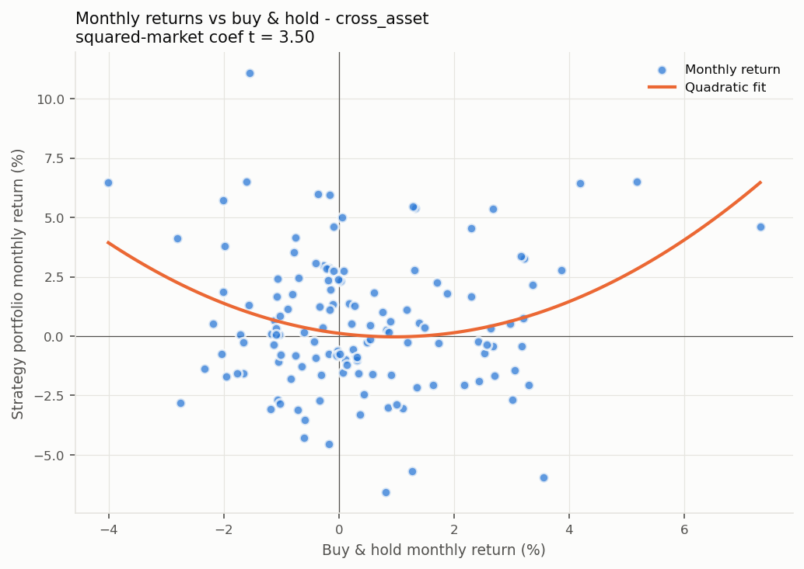
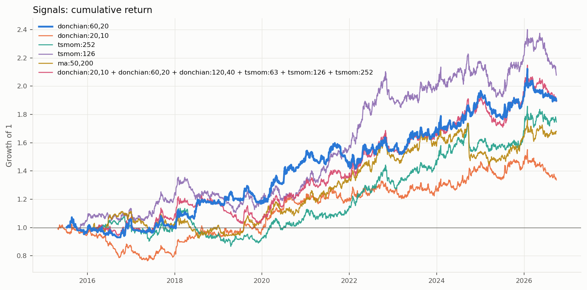
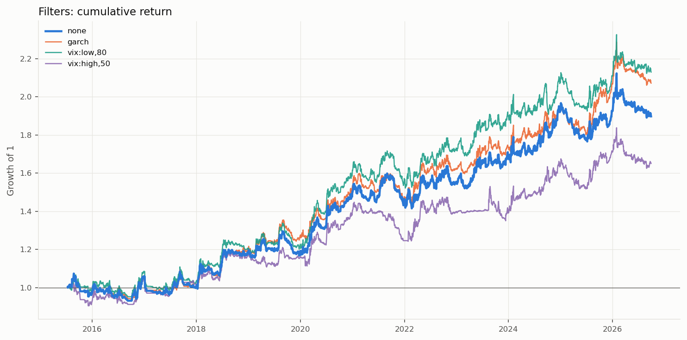
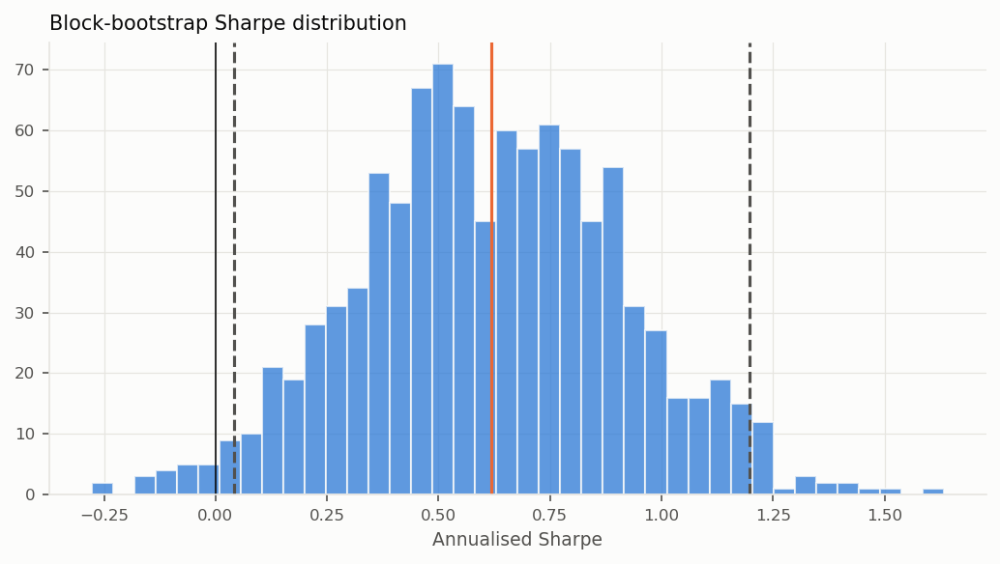

# 跨资产组合回测

> 生成时间: 2026-09-29 08:35 | 配置: `strategies/turtle/configs/cross_asset.toml`  
> **信号**: `donchian:60,20` | **过滤**: `none` | 周期: 1d | 起始: 2015-01-01  
> 组合: 各类别内等权, 再类别间等权 | 组合缩放到 10% 目标波动  
> 执行: 收盘价成交, 1% 风险/ATR 定仓位, 逐根盯市, 止损跳空按开盘价, 信号用复权价、盈亏用真实价格

| 市场 | 手续费 (单边) | 印花税 | 滑点 | 做空 | 每品种本金 |
|---|---:|---:|---:|---|---:|
| future | 1.0‱ | 0‱ | 1 跳 (最小变动价位) | 可以 | 10,000,000 |
| fx | 0.2‱ | 0‱ | 1.0‱ | 可以 | 1,000,000 |

按手收手续费的品种: T, TF, TL, TS; 其余期货按费率。

---

## 一、各品种表现

| 类别 | 品种 | 周期 | 起始 | 交易 | 年化% | 年化波动% | 夏普 | PF | 最大回撤% | Calmar | 持仓占比% |
|---|---|---|---|---:|---:|---:|---:|---:|---:|---:|---:|
| 股指 | IF | 1d | 2019-01-18 | 31 | +2.3 | 9.8 | 0.28 | 1.44 | -17.3 | 0.13 | 49 |
| 股指 | IH | 1d | 2019-01-18 | 26 | +0.6 | 9.8 | 0.11 | 1.11 | -23.1 | 0.02 | 48 |
| 股指 | IC | 1d | 2019-01-18 | 28 | +1.5 | 9.7 | 0.20 | 1.32 | -16.9 | 0.09 | 48 |
| 股指 | IM | 1d | 2022-10-26 | 12 | +4.9 | 9.8 | 0.54 | 3.42 | -11.7 | 0.42 | 53 |
| 国债 | T | 1d | 2019-02-15 | 26 | +4.5 | 9.0 | 0.53 | 1.87 | -18.8 | 0.24 | 53 |
| 国债 | TF | 1d | 2019-03-12 | 22 | +6.9 | 9.5 | 0.75 | 2.94 | -13.4 | 0.52 | 53 |
| 国债 | TS | 1d | 2019-04-22 | 23 | +4.9 | 8.8 | 0.59 | 2.35 | -14.1 | 0.35 | 51 |
| 国债 | TL | 1d | 2023-07-25 | 11 | +8.5 | 11.4 | 0.77 | 2.54 | -16.9 | 0.50 | 55 |
| 商品 | RB | 1d | 2018-08-13 | 33 | -1.7 | 8.7 | -0.15 | 0.71 | -22.8 | -0.07 | 49 |
| 商品 | I | 1d | 2018-08-02 | 32 | +1.9 | 9.0 | 0.25 | 1.29 | -28.0 | 0.07 | 49 |
| 商品 | CU | 1d | 2018-08-13 | 33 | +1.6 | 11.1 | 0.20 | 1.24 | -25.3 | 0.06 | 40 |
| 商品 | AL | 1d | 2018-08-13 | 31 | +1.4 | 10.6 | 0.19 | 1.26 | -25.6 | 0.06 | 47 |
| 商品 | AU | 1d | 2018-09-13 | 26 | +9.0 | 14.9 | 0.65 | 3.57 | -21.6 | 0.42 | 54 |
| 商品 | AG | 1d | 2018-08-13 | 33 | +4.8 | 17.8 | 0.35 | 1.85 | -35.8 | 0.14 | 42 |
| 商品 | SC | 1d | 2018-08-03 | 33 | +1.4 | 11.6 | 0.17 | 1.29 | -18.4 | 0.07 | 48 |
| 商品 | TA | 1d | 2018-08-13 | 29 | +4.9 | 11.6 | 0.47 | 2.21 | -15.8 | 0.31 | 53 |
| 商品 | MA | 1d | 2018-08-15 | 40 | -5.6 | 8.4 | -0.64 | 0.31 | -41.7 | -0.13 | 45 |
| 商品 | M | 1d | 2018-08-13 | 29 | +2.3 | 8.8 | 0.30 | 1.52 | -18.4 | 0.12 | 50 |
| 商品 | Y | 1d | 2018-08-13 | 28 | +2.3 | 8.4 | 0.31 | 1.47 | -19.8 | 0.12 | 48 |
| 商品 | CF | 1d | 2018-08-13 | 30 | +5.8 | 10.0 | 0.61 | 2.41 | -11.8 | 0.49 | 57 |
| 商品 | SR | 1d | 2018-04-09 | 39 | -4.4 | 7.4 | -0.57 | 0.41 | -36.3 | -0.12 | 41 |
| 汇率 | USDCNH | 1d | 2015-03-30 | 37 | +8.3 | 10.7 | 0.80 | 3.94 | -13.6 | 0.61 | 58 |
| 汇率 | EURUSD | 1d | 2015-03-30 | 53 | -3.3 | 6.9 | -0.46 | 0.50 | -37.6 | -0.09 | 43 |
| 汇率 | USDJPY | 1d | 2015-03-30 | 56 | -2.7 | 8.2 | -0.30 | 0.59 | -30.1 | -0.09 | 46 |
| 汇率 | AUDUSD | 1d | 2015-03-30 | 56 | -4.3 | 7.5 | -0.55 | 0.39 | -41.6 | -0.10 | 47 |
| 汇率 | GBPUSD | 1d | 2015-03-30 | 56 | -3.7 | 7.3 | -0.47 | 0.46 | -34.9 | -0.10 | 48 |

---

## 三、各资产类别 (类别内等权)

|  | 起始 | 年化收益% | 年化波动% | 夏普 | Sortino | 最大回撤% | Calmar | 成员数 |
|---|---|---:|---:|---:|---:|---:|---:|---:|
| 股指 | 2019-01-21 | +2.2 | 8.4 | 0.31 | 0.34 | -12.5 | 0.18 | 4 |
| 国债 | 2019-02-18 | +5.8 | 8.2 | 0.73 | 0.86 | -13.4 | 0.43 | 4 |
| 商品 | 2018-04-10 | +2.6 | 5.1 | 0.53 | 0.63 | -7.5 | 0.35 | 13 |
| 汇率 | 2015-03-31 | -1.0 | 5.0 | -0.18 | -0.23 | -15.0 | -0.07 | 5 |
| 组合 (全样本) | 2015-03-31 | +1.7 | 3.9 | 0.45 | 0.60 | -6.8 | 0.25 | 26 |
| 组合 (全部类别到齐后) | 2019-02-18 | +2.3 | 3.6 | 0.66 | 0.89 | -4.3 | 0.54 | 26 |

类别开始时间不同时, 早期的组合只由已有数据的类别构成, "全部类别到齐后"才是完整的跨资产组合。

类别之间的相关性 (策略日收益):

|  | 股指 | 国债 | 商品 | 汇率 |
|---|---:|---:|---:|---:|
| 股指 | 1.00 | -0.01 | 0.11 | 0.06 |
| 国债 | -0.01 | 1.00 | 0.02 | -0.01 |
| 商品 | 0.11 | 0.02 | 1.00 | 0.08 |
| 汇率 | 0.06 | -0.01 | 0.08 | 1.00 |

品种两两相关性平均: **类内 0.19**, **跨类 0.02** (对照 TSMOM 论文 Table 4)。

---

## 四、组合目标波动率 10%

|  | 起始 | 年化收益% | 年化波动% | 夏普 | Sortino | 最大回撤% | Calmar | 平均杠杆 | 最高杠杆 |
|---|---|---:|---:|---:|---:|---:|---:|---:|---:|
| 原始 | 2015-03-31 | +1.7 | 3.9 | 0.45 | 0.60 | -6.8 | 0.25 | 1.0 | 1.0 |
| 缩放后 | 2015-07-13 | +5.9 | 10.0 | 0.62 | 0.87 | -13.3 | 0.44 | 2.7 | 4.9 |

杠杆 = 目标波动 / 过去波动 (EWMA, 质心 60 天, 上限 10 倍), 只用过去数据。夏普基本不变, 收益和回撤同比例放大。以下各节使用缩放后的组合。

---

## 五、压力时期

| 时期 | 区间 | 策略组合% | 买入持有% | 当时有数据的类别 |
|---|---|---:|---:|---|
| 2015 股灾 | 2015-06-15 ~ 2015-09-15 | +2.0 | -0.5 | 汇率 |
| 2016 熔断 | 2016-01-01 ~ 2016-01-29 | +1.7 | -1.1 | 汇率 |
| 2018 贸易摩擦 | 2018-03-22 ~ 2018-12-31 | +8.2 | -3.1 | 商品, 汇率 |
| 2020 疫情冲击 | 2020-01-20 ~ 2020-03-23 | +11.1 | -9.0 | 股指, 国债, 商品, 汇率 |
| 2022 全球加息 | 2022-01-01 ~ 2022-10-31 | +12.1 | -4.9 | 股指, 国债, 商品, 汇率 |
| 2022 LUNA 崩盘 | 2022-05-05 ~ 2022-06-18 | -0.7 | +1.7 | 股指, 国债, 商品, 汇率 |
| 2022 FTX 破产 | 2022-11-06 ~ 2022-11-21 | -1.8 | +0.3 | 股指, 国债, 商品, 汇率 |
| 2024 年初小盘股下跌 | 2024-01-02 ~ 2024-02-05 | +5.8 | -4.6 | 股指, 国债, 商品, 汇率 |
| 2024-08 日元套息平仓 | 2024-07-31 ~ 2024-08-07 | +1.4 | -0.6 | 股指, 国债, 商品, 汇率 |
| 2025-04 关税冲击 | 2025-04-02 ~ 2025-04-09 | -2.1 | -3.1 | 股指, 国债, 商品, 汇率 |

日期为大致区间, 用来观察趋势策略在危机中的表现。

---

## 六、组合表现与风险特征

#### 组合表现 (donchian:60,20 | none; 4 个类别、26 个品种×周期, 2015-07-13 ~ 2026-09-28)

| 指标 | 策略组合 | 基准: 等权买入持有 |
|---|---:|---:|
| 年化收益 % | +5.9 | +4.3 |
| 年化波动 % | 10.0 | 6.4 |
| 夏普 | 0.62 | 0.68 |
| Sortino | 0.87 | 0.89 |
| 最大回撤 % | -13.3 | -9.4 |
| Calmar | 0.44 | 0.45 |

跨类别品种两两相关性平均: 0.02  (越低, 分散化降波动的效果越好)

| 年份 | 策略组合 | 等权持有 |
|---|---:|---:|
| 2015 | -2.5% | -1.1% |
| 2016 | +7.9% | -3.3% |
| 2017 | -4.4% | +4.2% |
| 2018 | +17.9% | -5.5% |
| 2019 | +0.5% | +12.9% |
| 2020 | +26.1% | +11.6% |
| 2021 | -2.9% | +6.6% |
| 2022 | +6.5% | -0.7% |
| 2023 | +8.7% | +2.5% |
| 2024 | +14.7% | +5.8% |
| 2025 | -0.6% | +11.5% |
| 2026 | -1.5% | +5.1% |

#### 风险特征 (月度回归, 括号内为 Newey-West t 值)

| 回归 | α (月) | 基准收益 | 基准收益² | 基准波动率 | 高波动哑变量 | R² |
|---|---:|---:|---:|---:|---:|---:|
| CAPM | 0.51% (2.39) | 0.019 (0.10) | | | | 0.00 |
| Smile | | -0.310 (-1.61) | 16.077 (3.50) | | | 0.08 |
| 波动率状态 | | | | 0.320 (2.27) | -0.99% (-1.00) | 0.04 |

样本 135 个月。读法:
- **CAPM α**: 月均 0.51% (年化约 6.1%), t = 2.39。显著, 扣除被动做多后仍有超额收益。
- **Smile**: 基准收益平方项 t = 3.50。显著为正: 大涨大跌时都赚钱, 类似 TSMOM 的 smile。
- **波动率状态**: 基准波动率 t = 2.27, 高波动哑变量 t = -1.00。策略收益与市场波动率状态有关。
- CAPM 的截距是 α (基准是可交易的等权持有组合); Smile 和波动率回归的截距没有 α 含义, 不报告。
- 高波动阈值用全样本 80% 分位数, 是描述性分析, 不能直接当交易规则。

---

## 七、稳定性检验

样本内 / 样本外分界: **2022-01-01** (样本内挑参数, 样本外检验)。

### 7.1 换信号

| signal | 年化收益% | 年化波动% | 夏普 | 最大回撤% | Calmar | 样本内夏普 | 样本外夏普 | 交易次数 |
|---|---:|---:|---:|---:|---:|---:|---:|---:|
| donchian:60,20 | +5.9 | 10.0 | 0.62 | -13.3 | 0.44 | 0.64 | 0.59 | 853 |
| donchian:20,10 | +2.6 | 10.2 | 0.30 | -25.3 | 0.10 | 0.33 | 0.26 | 1767 |
| tsmom:252 | +5.4 | 10.1 | 0.58 | -23.7 | 0.23 | 0.29 | 0.92 | 1286 |
| tsmom:126 | +6.9 | 10.0 | 0.72 | -18.5 | 0.37 | 0.79 | 0.62 | 1951 |
| ma:50,200 | +5.0 | 10.1 | 0.53 | -17.1 | 0.29 | 0.56 | 0.50 | 311 |
| donchian:20,10 + donchian:60,20 + donchian:120,40 + tsmom:63 + tsmom:126 + tsmom:252 | +6.2 | 10.1 | 0.65 | -16.1 | 0.39 | 0.61 | 0.70 | 9304 |

日收益相关性 (越低, 组合在一起越有分散效果):

|  | donchian:60,20 | donchian:20,10 | tsmom:252 | tsmom:126 | ma:50,200 | donchian:20,10 + donchian:60,20 + donchian:120,40 + tsmom:63 + tsmom:126 + tsmom:252 |
|---|---:|---:|---:|---:|---:|---:|
| donchian:60,20 | 1.00 | 0.75 | 0.48 | 0.67 | 0.50 | 0.87 |
| donchian:20,10 | 0.75 | 1.00 | 0.28 | 0.41 | 0.21 | 0.69 |
| tsmom:252 | 0.48 | 0.28 | 1.00 | 0.65 | 0.73 | 0.69 |
| tsmom:126 | 0.67 | 0.41 | 0.65 | 1.00 | 0.74 | 0.82 |
| ma:50,200 | 0.50 | 0.21 | 0.73 | 0.74 | 1.00 | 0.68 |
| donchian:20,10 + donchian:60,20 + donchian:120,40 + tsmom:63 + tsmom:126 + tsmom:252 | 0.87 | 0.69 | 0.69 | 0.82 | 0.68 | 1.00 |

### 7.2 换过滤器

| filter | 年化收益% | 年化波动% | 夏普 | 最大回撤% | Calmar | 样本内夏普 | 样本外夏普 | 交易次数 | 被挡掉的入场 |
|---|---:|---:|---:|---:|---:|---:|---:|---:|---:|
| none | +5.9 | 10.0 | 0.62 | -13.3 | 0.44 | 0.64 | 0.59 | 853 | 0 |
| garch | +6.7 | 10.0 | 0.70 | -13.1 | 0.51 | 0.66 | 0.76 | 610 | 977 |
| vix:low,80 | +7.0 | 10.0 | 0.72 | -11.4 | 0.62 | 0.76 | 0.68 | 737 | 406 |
| vix:high,50 | +4.6 | 9.9 | 0.50 | -14.2 | 0.33 | 0.41 | 0.62 | 551 | 1290 |

日收益相关性 (越低, 组合在一起越有分散效果):

|  | none | garch | vix:low,80 | vix:high,50 |
|---|---:|---:|---:|---:|
| none | 1.00 | 0.95 | 0.96 | 0.85 |
| garch | 0.95 | 1.00 | 0.90 | 0.84 |
| vix:low,80 | 0.96 | 0.90 | 1.00 | 0.77 |
| vix:high,50 | 0.85 | 0.84 | 0.77 | 1.00 |

过滤器只是挡掉部分入场, 如果"被挡掉的入场"很多而夏普没提高, 说明它挡掉的并不是坏交易。

### 7.3 参数网格

| label | 夏普 | 样本内夏普 | 样本外夏普 |
|---|---:|---:|---:|
| donchian:150,30 | 0.80 | 0.68 | 0.94 |
| donchian:150,50 | 0.77 | 0.60 | 0.99 |
| donchian:150,20 | 0.74 | 0.60 | 0.89 |
| donchian:60,30 | 0.67 | 0.70 | 0.63 |
| donchian:40,30 | 0.64 | 0.67 | 0.59 |
| donchian:40,20 | 0.62 | 0.66 | 0.57 |
| donchian:60,20 | 0.62 | 0.64 | 0.59 |
| donchian:60,50 | 0.61 | 0.61 | 0.62 |
| donchian:100,30 | 0.58 | 0.44 | 0.75 |
| donchian:60,10 | 0.54 | 0.73 | 0.30 |
| donchian:100,50 | 0.54 | 0.35 | 0.78 |
| donchian:40,10 | 0.51 | 0.70 | 0.27 |
| donchian:100,20 | 0.51 | 0.33 | 0.74 |
| donchian:150,10 | 0.51 | 0.59 | 0.42 |
| donchian:20,20 | 0.44 | 0.46 | 0.41 |
| donchian:100,10 | 0.35 | 0.32 | 0.39 |
| donchian:20,10 | 0.30 | 0.33 | 0.26 |

- 夏普为正的参数组合占 **100%**; 各参数样本外夏普中位数 **0.59**
- 样本内最好的参数 `donchian:60,10`: 样本内 0.73 → 样本外 **0.30**
- 当前参数 `donchian:60,20`: 样本内 0.64 → 样本外 0.59
- 读法: 一片颜色相近的高原 = 参数不敏感, 结果可信; 只有一个格子特别亮 = 大概率是过拟合。样本内最好的参数到样本外掉得越多, 说明挑参数的收益越不可靠。

### 7.4 分年度

| 年份 | 收益% | 夏普 | 最大回撤% |
|---|---:|---:|---:|
| 2015 | -2.5 | -0.40 | -11.2 |
| 2016 | +7.9 | 0.77 | -8.6 |
| 2017 | -4.4 | -0.48 | -9.2 |
| 2018 | +17.9 | 1.67 | -5.5 |
| 2019 | +0.5 | 0.10 | -9.9 |
| 2020 | +26.1 | 2.10 | -4.4 |
| 2021 | -2.9 | -0.30 | -10.5 |
| 2022 | +6.5 | 0.61 | -6.6 |
| 2023 | +8.7 | 0.92 | -4.9 |
| 2024 | +14.7 | 1.29 | -5.7 |
| 2025 | -0.6 | -0.02 | -10.2 |
| 2026 | -1.5 | -0.16 | -10.9 |

赚钱的年份: 7 / 12。

### 7.5 自助法夏普置信区间

按 20 天分块有放回重抽组合日收益 1000 次 (保留波动聚集和短期自相关):

- 夏普 **0.62**, 95% 区间 **[0.04, 1.20]**
- 重抽样本中夏普 ≤ 0 的比例: **1.8%** (区间不含 0, 收益不太可能纯属运气)
- 注意: 这只衡量样本内的抽样误差, 不能纠正"试了很多策略挑最好的"带来的偏差。

### 7.6 成本敏感性 (滑点倍数)

| 滑点倍数 | 年化收益% | 年化波动% | 夏普 | 最大回撤% | Calmar |
|---|---:|---:|---:|---:|---:|
| ×0 | +6.2 | 10.0 | 0.65 | -13.1 | 0.47 |
| ×1 | +5.9 | 10.0 | 0.62 | -13.3 | 0.44 |
| ×2 | +5.6 | 10.0 | 0.59 | -13.5 | 0.41 |
| ×4 | +4.4 | 10.0 | 0.48 | -15.3 | 0.29 |

滑点翻倍后夏普还剩多少, 决定了策略在真实交易中能不能活下来。

---

## 八、和沪深300 组合: 这个策略有没有用

股票: 沪深300 价格指数 (不含分红); 策略: 报告主组合 (缩放后); 区间 2015-07-13 ~ 2026-09-28。

- **配置**: 总资金按比例分给股票和策略, 每天再平衡到固定比例 (简化; 按月再平衡结果相近)
- **叠加**: 股票仓位 100% 不变, 另用保证金叠加策略 (期货只占用少量保证金, 实际可行, 但总风险更高)

| 组合 | 年化收益% | 年化波动% | 夏普 | 最大回撤% | Calmar | 股票下跌月份平均月收益% | 最差月份% |
|---|---:|---:|---:|---:|---:|---:|---:|
| 股票 100% | +0.5 | 19.9 | 0.13 | -45.6 | 0.01 | -4.11 | -21.0 |
| 股票 90% + 策略 10% | +1.3 | 17.9 | 0.16 | -40.6 | 0.03 | -3.62 | -18.9 |
| 股票 80% + 策略 20% | +2.0 | 16.0 | 0.20 | -35.7 | 0.06 | -3.14 | -16.8 |
| 股票 70% + 策略 30% | +2.6 | 14.2 | 0.25 | -30.7 | 0.09 | -2.66 | -14.6 |
| 股票 50% + 策略 50% | +3.8 | 11.1 | 0.39 | -20.3 | 0.19 | -1.70 | -10.1 |
| 股票 100% + 叠加策略 50% | +3.6 | 20.5 | 0.27 | -41.0 | 0.09 | -3.77 | -20.4 |
| 股票 100% + 叠加策略 100% | +6.4 | 22.3 | 0.39 | -37.8 | 0.17 | -3.44 | -19.8 |
| 策略 100% | +5.9 | 10.0 | 0.62 | -13.3 | 0.44 | +0.69 | -6.6 |

策略与沪深300 的相关性: 日度 **0.00**, 月度 **-0.01** (日度受两个市场收盘时间错位影响, 月度更可靠)。

- 单独持有沪深300: 夏普 0.13, 最大回撤 -45.6%
- 夏普最高的组合: **股票 50% + 策略 50%**, 夏普 0.39, 最大回撤 -20.3%
- "股票下跌月份平均月收益"越高, 说明策略在股票亏钱的月份补得越多 (对冲作用)。
- 读法: 加入策略后夏普上升、回撤变小, 说明策略有配置价值, 哪怕它单独的收益不高。

逐年收益:

| 年份 | 沪深300 | 策略 | 股票90%+策略10% | 股票80%+策略20% | 股票70%+策略30% | 股票50%+策略50% |
|---|---:|---:|---:|---:|---:|---:|
| 2015 | -9.1 | -2.5 | -8.1 | -7.2 | -6.3 | -4.8 |
| 2016 | -11.3 | +7.9 | -9.3 | -7.3 | -5.3 | -1.5 |
| 2017 | +22.2 | -4.4 | +19.3 | +16.5 | +13.7 | +8.3 |
| 2018 | -25.3 | +17.9 | -21.6 | -17.8 | -13.8 | -5.4 |
| 2019 | +36.1 | +0.5 | +32.2 | +28.4 | +24.7 | +17.4 |
| 2020 | +27.2 | +26.1 | +27.4 | +27.5 | +27.6 | +27.5 |
| 2021 | -5.2 | -2.9 | -4.8 | -4.5 | -4.2 | -3.6 |
| 2022 | -21.6 | +6.5 | -18.9 | -16.2 | -13.4 | -7.8 |
| 2023 | -11.4 | +8.7 | -9.4 | -7.4 | -5.4 | -1.4 |
| 2024 | +14.7 | +14.7 | +15.0 | +15.2 | +15.4 | +15.5 |
| 2025 | +17.7 | -0.6 | +15.8 | +13.9 | +12.1 | +8.4 |
| 2026 | -6.2 | -1.5 | -5.7 | -5.1 | -4.6 | -3.6 |
