# 海龟交易系统 — 多币种稳健性回测报告

> 生成时间: 2026-09-28 17:44  
> 回测区间: 2022-01-01 ~ 今  
> 仓位: 1% 资金/ATR | 止损: 2N | 手续费: 0.05% | 滑点: 3‱/次 | 权益逐根盯市, 止损跳空按开盘价  
> 币种数: 14 个成功, 6 个跳过 (BNB, ZEC, HYPE, CC, HBAR, SUI)

---

## 一、各币种详细回测

### ADA

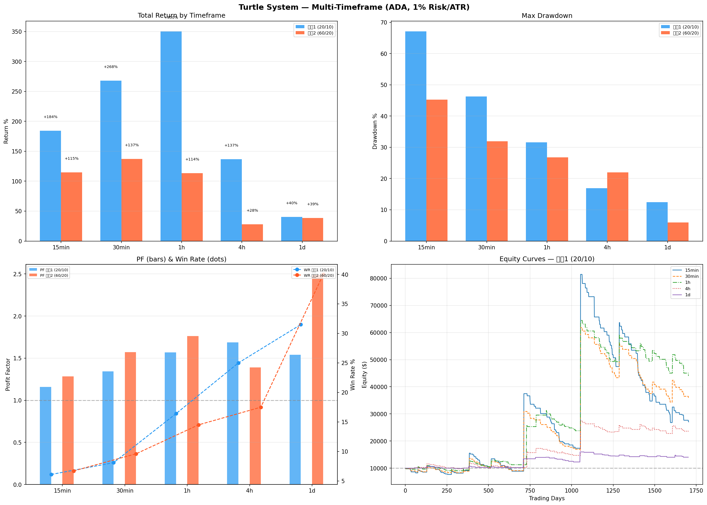

| K线 | 系统 | 交易 | 总收益% | 年化% | 夏普 | 胜率% | PF | 回撤% | Calmar |
|---:|---:|---:|---:|---:|---:|---:|---:|---:|---:|
| 15min | 系统1 (20/10) | 200 | +117.0 | +18.0 | 0.59 | 5.5 | 1.11 | -77.5 | 0.232 |
| 15min | 系统2 (60/20) | 109 | +63.5 | +11.3 | 0.47 | 6.4 | 1.18 | -70.2 | 0.162 |
| 30min | 系统1 (20/10) | 151 | +215.0 | +27.8 | 0.70 | 7.3 | 1.29 | -61.8 | 0.449 |
| 30min | 系统2 (60/20) | 76 | +114.7 | +18.2 | 0.57 | 9.2 | 1.48 | -60.6 | 0.300 |
| 1h | 系统1 (20/10) | 113 | +243.4 | +30.1 | 0.76 | 15.0 | 1.47 | -53.5 | 0.563 |
| 1h | 系统2 (60/20) | 56 | +105.4 | +17.0 | 0.57 | 14.3 | 1.69 | -51.8 | 0.329 |
| 4h | 系统1 (20/10) | 76 | +134.2 | +19.9 | 0.74 | 25.0 | 1.68 | -35.3 | 0.565 |
| 4h | 系统2 (60/20) | 41 | +24.7 | +4.9 | 0.31 | 17.1 | 1.33 | -38.6 | 0.128 |
| 1d | 系统1 (20/10) | 54 | +39.7 | +7.4 | 0.58 | 31.5 | 1.53 | -19.7 | 0.375 |
| 1d | 系统2 (60/20) | 20 | +38.5 | +7.4 | 0.51 | 40.0 | 2.48 | -22.5 | 0.328 |

### AVAX

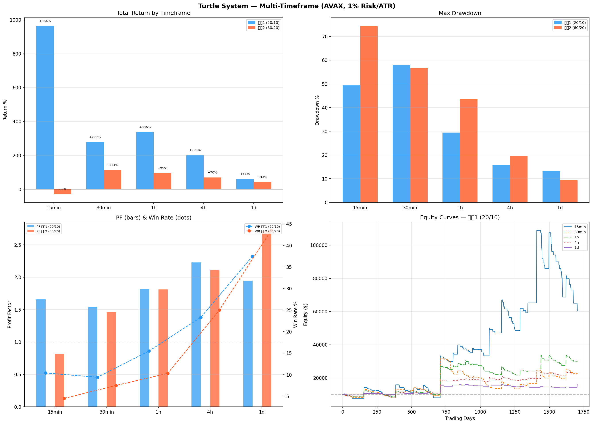

| K线 | 系统 | 交易 | 总收益% | 年化% | 夏普 | 胜率% | PF | 回撤% | Calmar |
|---:|---:|---:|---:|---:|---:|---:|---:|---:|---:|
| 15min | 系统1 (20/10) | 194 | +668.3 | +54.5 | 0.88 | 10.3 | 1.49 | -65.2 | 0.836 |
| 15min | 系统2 (60/20) | 136 | -49.2 | -13.8 | 0.09 | 4.4 | 0.68 | -77.2 | -0.178 |
| 30min | 系统1 (20/10) | 160 | +209.7 | +27.3 | 0.66 | 9.4 | 1.41 | -68.8 | 0.396 |
| 30min | 系统2 (60/20) | 94 | +75.5 | +13.1 | 0.49 | 7.4 | 1.30 | -76.3 | 0.171 |
| 1h | 系统1 (20/10) | 117 | +271.8 | +32.4 | 0.79 | 15.4 | 1.68 | -37.6 | 0.860 |
| 1h | 系统2 (60/20) | 59 | +68.5 | +12.1 | 0.47 | 10.2 | 1.58 | -54.8 | 0.220 |
| 4h | 系统1 (20/10) | 73 | +181.4 | +24.7 | 0.90 | 23.3 | 2.10 | -26.4 | 0.937 |
| 4h | 系统2 (60/20) | 36 | +58.1 | +10.5 | 0.51 | 25.0 | 1.93 | -43.1 | 0.245 |
| 1d | 系统1 (20/10) | 48 | +56.2 | +10.0 | 0.76 | 37.5 | 1.87 | -19.5 | 0.512 |
| 1d | 系统2 (60/20) | 23 | +38.8 | +7.4 | 0.60 | 43.5 | 2.54 | -24.1 | 0.309 |

### BCH

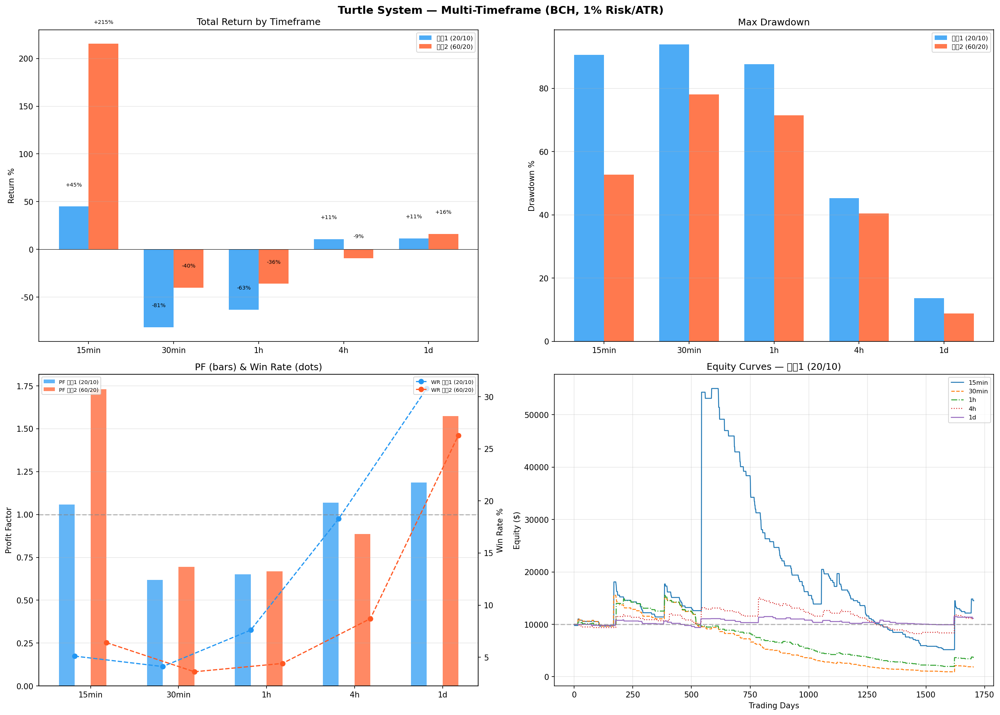

| K线 | 系统 | 交易 | 总收益% | 年化% | 夏普 | 胜率% | PF | 回撤% | Calmar |
|---:|---:|---:|---:|---:|---:|---:|---:|---:|---:|
| 15min | 系统1 (20/10) | 200 | +14.8 | +3.0 | 0.42 | 5.0 | 1.02 | -94.3 | 0.032 |
| 15min | 系统2 (60/20) | 80 | +186.2 | +25.8 | 0.63 | 6.2 | 1.61 | -75.5 | 0.342 |
| 30min | 系统1 (20/10) | 174 | -83.9 | -32.2 | -0.38 | 4.0 | 0.60 | -95.6 | -0.337 |
| 30min | 系统2 (60/20) | 84 | -43.6 | -11.8 | -0.01 | 3.6 | 0.67 | -79.9 | -0.147 |
| 1h | 系统1 (20/10) | 133 | -65.7 | -20.4 | -0.26 | 7.5 | 0.64 | -90.3 | -0.226 |
| 1h | 系统2 (60/20) | 69 | -38.0 | -9.9 | -0.09 | 4.3 | 0.66 | -73.5 | -0.135 |
| 4h | 系统1 (20/10) | 82 | +7.0 | +1.5 | 0.20 | 18.3 | 1.04 | -56.2 | 0.026 |
| 4h | 系统2 (60/20) | 47 | -11.8 | -2.7 | -0.02 | 8.5 | 0.86 | -53.1 | -0.051 |
| 1d | 系统1 (20/10) | 52 | +8.7 | +1.8 | 0.19 | 30.8 | 1.14 | -22.1 | 0.081 |
| 1d | 系统2 (60/20) | 20 | +13.8 | +2.9 | 0.33 | 25.0 | 1.45 | -17.9 | 0.161 |

### BTC

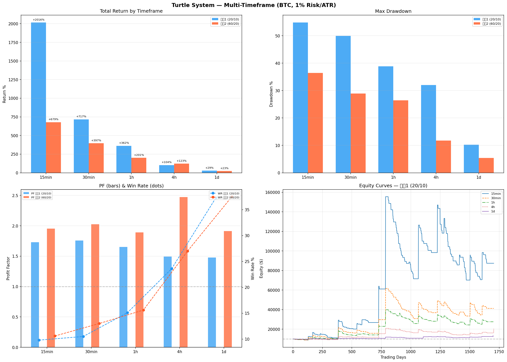

| K线 | 系统 | 交易 | 总收益% | 年化% | 夏普 | 胜率% | PF | 回撤% | Calmar |
|---:|---:|---:|---:|---:|---:|---:|---:|---:|---:|
| 15min | 系统1 (20/10) | 175 | +1585.0 | +82.7 | 1.10 | 9.7 | 1.61 | -68.4 | 1.209 |
| 15min | 系统2 (60/20) | 96 | +549.4 | +50.5 | 0.89 | 10.4 | 1.77 | -55.0 | 0.918 |
| 30min | 系统1 (20/10) | 143 | +621.6 | +52.5 | 0.95 | 10.5 | 1.68 | -59.6 | 0.881 |
| 30min | 系统2 (60/20) | 77 | +356.7 | +39.4 | 0.84 | 13.0 | 1.93 | -52.5 | 0.750 |
| 1h | 系统1 (20/10) | 126 | +325.6 | +36.2 | 0.85 | 15.1 | 1.59 | -49.7 | 0.729 |
| 1h | 系统2 (60/20) | 64 | +185.5 | +25.8 | 0.72 | 15.6 | 1.82 | -45.5 | 0.567 |
| 4h | 系统1 (20/10) | 89 | +96.6 | +15.5 | 0.66 | 23.6 | 1.46 | -39.5 | 0.394 |
| 4h | 系统2 (60/20) | 37 | +118.1 | +18.6 | 0.76 | 27.0 | 2.41 | -24.1 | 0.771 |
| 1d | 系统1 (20/10) | 51 | +26.0 | +5.1 | 0.47 | 37.3 | 1.42 | -15.2 | 0.332 |
| 1d | 系统2 (60/20) | 24 | +21.0 | +4.2 | 0.43 | 37.5 | 1.76 | -12.0 | 0.355 |

### DOGE

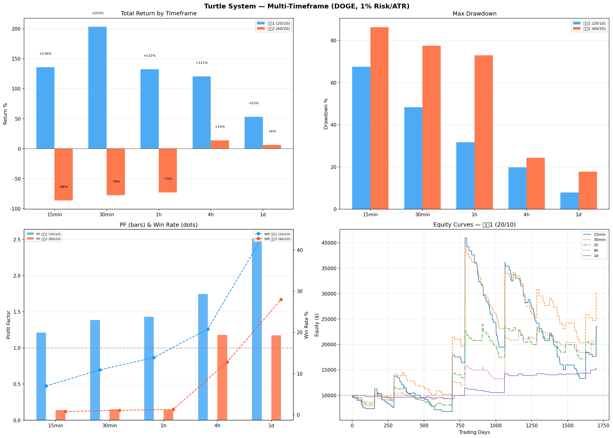

| K线 | 系统 | 交易 | 总收益% | 年化% | 夏普 | 胜率% | PF | 回撤% | Calmar |
|---:|---:|---:|---:|---:|---:|---:|---:|---:|---:|
| 15min | 系统1 (20/10) | 175 | +95.5 | +15.4 | 0.57 | 6.9 | 1.15 | -81.4 | 0.189 |
| 15min | 系统2 (60/20) | 120 | -87.7 | -36.8 | -0.34 | 0.8 | 0.13 | -95.9 | -0.384 |
| 30min | 系统1 (20/10) | 129 | +181.0 | +24.7 | 0.64 | 10.9 | 1.34 | -68.4 | 0.361 |
| 30min | 系统2 (60/20) | 90 | -78.8 | -28.8 | -0.38 | 1.1 | 0.14 | -91.2 | -0.315 |
| 1h | 系统1 (20/10) | 113 | +95.4 | +15.4 | 0.52 | 13.3 | 1.29 | -62.4 | 0.246 |
| 1h | 系统2 (60/20) | 77 | -73.6 | -25.2 | -0.50 | 1.3 | 0.14 | -86.8 | -0.291 |
| 4h | 系统1 (20/10) | 75 | +92.6 | +15.0 | 0.57 | 18.7 | 1.58 | -43.4 | 0.346 |
| 4h | 系统2 (60/20) | 39 | +13.2 | +2.8 | 0.24 | 12.8 | 1.17 | -47.7 | 0.058 |
| 1d | 系统1 (20/10) | 43 | +50.2 | +9.1 | 0.59 | 41.9 | 2.34 | -20.1 | 0.451 |
| 1d | 系统2 (60/20) | 25 | +6.0 | +1.3 | 0.16 | 28.0 | 1.17 | -30.5 | 0.042 |

### ETH

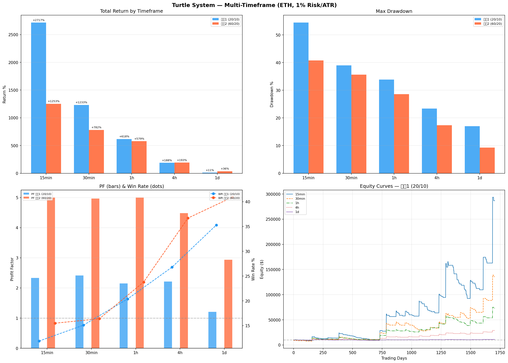

| K线 | 系统 | 交易 | 总收益% | 年化% | 夏普 | 胜率% | PF | 回撤% | Calmar |
|---:|---:|---:|---:|---:|---:|---:|---:|---:|---:|
| 15min | 系统1 (20/10) | 159 | +2321.5 | +97.4 | 1.18 | 11.3 | 2.17 | -65.5 | 1.488 |
| 15min | 系统2 (60/20) | 58 | +1107.7 | +72.4 | 1.07 | 15.5 | 6.35 | -58.6 | 1.234 |
| 30min | 系统1 (20/10) | 139 | +1103.0 | +70.0 | 1.17 | 14.4 | 2.26 | -51.0 | 1.374 |
| 30min | 系统2 (60/20) | 62 | +258.6 | +32.2 | 0.78 | 14.5 | 2.92 | -54.1 | 0.595 |
| 1h | 系统1 (20/10) | 109 | +534.6 | +48.4 | 1.03 | 19.3 | 2.01 | -44.0 | 1.098 |
| 1h | 系统2 (60/20) | 43 | +501.0 | +48.0 | 1.08 | 23.3 | 5.22 | -38.3 | 1.253 |
| 4h | 系统1 (20/10) | 71 | +178.1 | +24.4 | 0.94 | 26.8 | 2.11 | -33.4 | 0.732 |
| 4h | 系统2 (60/20) | 31 | +177.7 | +25.0 | 0.97 | 35.5 | 4.05 | -25.5 | 0.980 |
| 1d | 系统1 (20/10) | 51 | +9.4 | +1.9 | 0.22 | 35.3 | 1.17 | -19.8 | 0.098 |
| 1d | 系统2 (60/20) | 22 | +34.7 | +6.7 | 0.59 | 40.9 | 2.83 | -15.4 | 0.437 |

### LINK

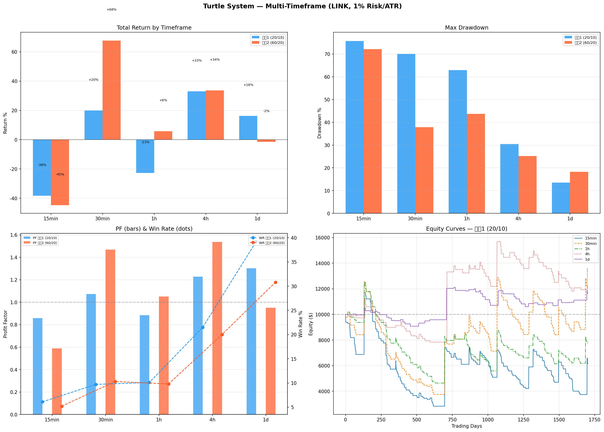

| K线 | 系统 | 交易 | 总收益% | 年化% | 夏普 | 胜率% | PF | 回撤% | Calmar |
|---:|---:|---:|---:|---:|---:|---:|---:|---:|---:|
| 15min | 系统1 (20/10) | 220 | -52.3 | -14.6 | 0.18 | 5.9 | 0.80 | -81.2 | -0.180 |
| 15min | 系统2 (60/20) | 100 | -52.3 | -14.9 | 0.06 | 5.0 | 0.54 | -78.8 | -0.189 |
| 30min | 系统1 (20/10) | 168 | +5.0 | +1.1 | 0.30 | 9.5 | 1.02 | -75.2 | 0.014 |
| 30min | 系统2 (60/20) | 69 | +59.5 | +10.7 | 0.45 | 10.1 | 1.40 | -57.7 | 0.186 |
| 1h | 系统1 (20/10) | 141 | -30.3 | -7.4 | 0.06 | 9.9 | 0.84 | -66.5 | -0.112 |
| 1h | 系统2 (60/20) | 62 | +1.7 | +0.4 | 0.21 | 9.7 | 1.01 | -56.8 | 0.006 |
| 4h | 系统1 (20/10) | 80 | +28.8 | +5.6 | 0.33 | 21.2 | 1.20 | -42.7 | 0.130 |
| 4h | 系统2 (60/20) | 36 | +30.4 | +6.0 | 0.34 | 19.4 | 1.46 | -37.4 | 0.160 |
| 1d | 系统1 (20/10) | 52 | +15.3 | +3.1 | 0.28 | 38.5 | 1.28 | -20.2 | 0.153 |
| 1d | 系统2 (60/20) | 27 | -2.2 | -0.5 | 0.04 | 29.6 | 0.93 | -22.1 | -0.022 |

### LTC

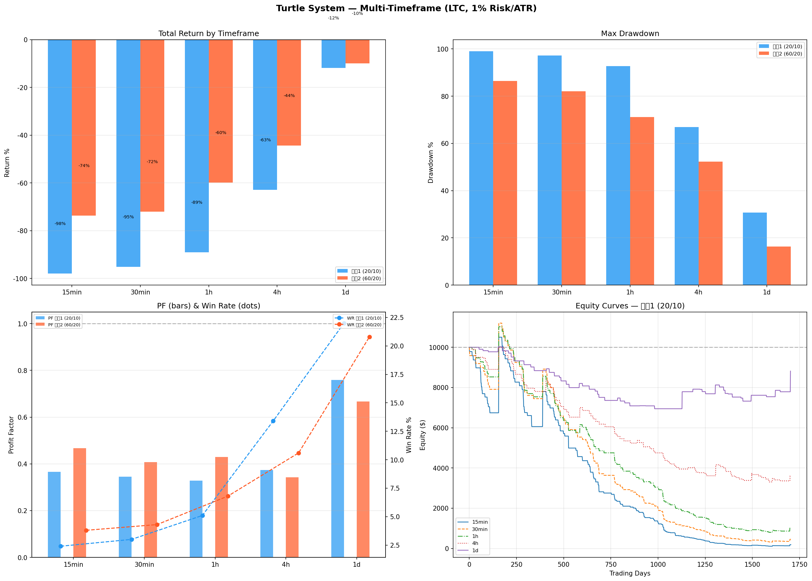

| K线 | 系统 | 交易 | 总收益% | 年化% | 夏普 | 胜率% | PF | 回撤% | Calmar |
|---:|---:|---:|---:|---:|---:|---:|---:|---:|---:|
| 15min | 系统1 (20/10) | 253 | -98.3 | -58.1 | -1.10 | 2.4 | 0.36 | -99.3 | -0.585 |
| 15min | 系统2 (60/20) | 108 | -76.8 | -27.3 | -0.38 | 3.7 | 0.46 | -89.7 | -0.305 |
| 30min | 系统1 (20/10) | 203 | -95.9 | -49.5 | -1.26 | 3.0 | 0.34 | -97.9 | -0.506 |
| 30min | 系统2 (60/20) | 96 | -74.7 | -25.9 | -0.63 | 4.2 | 0.40 | -85.4 | -0.304 |
| 1h | 系统1 (20/10) | 160 | -90.3 | -39.3 | -1.25 | 5.0 | 0.32 | -94.2 | -0.417 |
| 1h | 系统2 (60/20) | 76 | -62.1 | -19.1 | -0.61 | 6.6 | 0.42 | -75.2 | -0.254 |
| 4h | 系统1 (20/10) | 97 | -61.1 | -18.2 | -0.81 | 12.4 | 0.39 | -69.3 | -0.263 |
| 4h | 系统2 (60/20) | 47 | -41.2 | -10.9 | -0.67 | 10.6 | 0.39 | -55.2 | -0.198 |
| 1d | 系统1 (20/10) | 50 | -8.2 | -1.8 | -0.06 | 22.0 | 0.83 | -32.7 | -0.056 |
| 1d | 系统2 (60/20) | 24 | -7.2 | -1.6 | -0.07 | 25.0 | 0.76 | -19.2 | -0.085 |

### NEAR

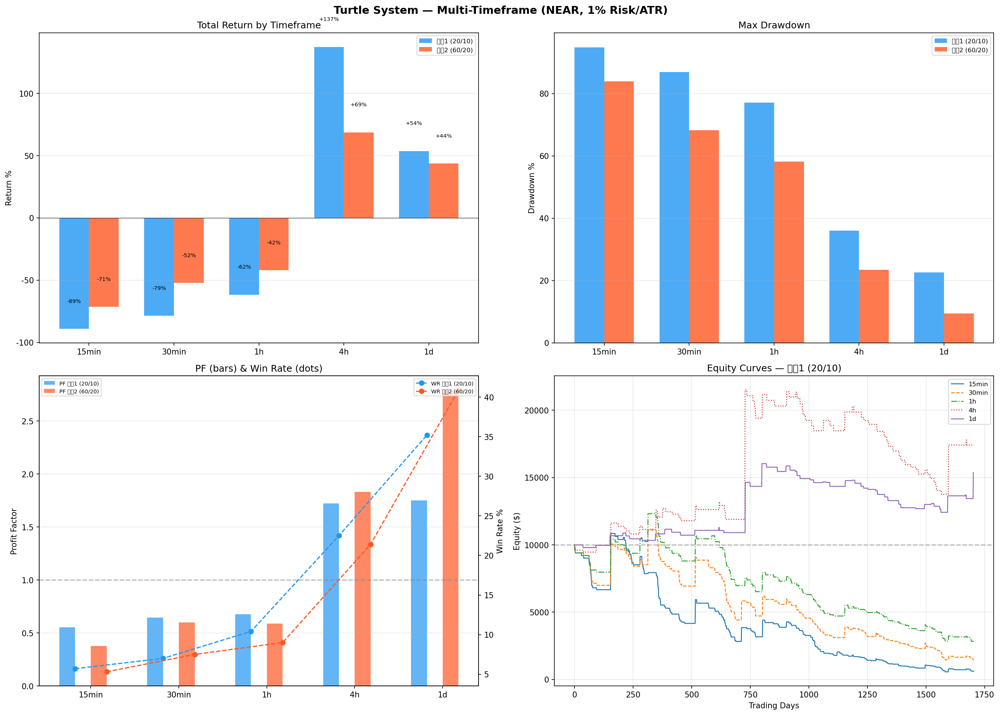

| K线 | 系统 | 交易 | 总收益% | 年化% | 夏普 | 胜率% | PF | 回撤% | Calmar |
|---:|---:|---:|---:|---:|---:|---:|---:|---:|---:|
| 15min | 系统1 (20/10) | 265 | -87.6 | -36.0 | -0.18 | 5.7 | 0.55 | -96.2 | -0.374 |
| 15min | 系统2 (60/20) | 132 | -65.6 | -20.8 | -0.00 | 5.3 | 0.43 | -85.2 | -0.244 |
| 30min | 系统1 (20/10) | 215 | -75.5 | -25.9 | -0.20 | 7.0 | 0.66 | -88.6 | -0.293 |
| 30min | 系统2 (60/20) | 106 | -43.3 | -11.7 | 0.03 | 7.5 | 0.67 | -71.9 | -0.162 |
| 1h | 系统1 (20/10) | 154 | -56.6 | -16.3 | -0.14 | 10.4 | 0.70 | -79.1 | -0.206 |
| 1h | 系统2 (60/20) | 78 | -33.1 | -8.4 | -0.02 | 9.0 | 0.68 | -63.5 | -0.132 |
| 4h | 系统1 (20/10) | 80 | +163.5 | +23.0 | 0.77 | 22.5 | 1.86 | -54.3 | 0.423 |
| 4h | 系统2 (60/20) | 42 | +88.3 | +14.8 | 0.61 | 21.4 | 2.07 | -48.6 | 0.305 |
| 1d | 系统1 (20/10) | 54 | +62.0 | +10.9 | 0.66 | 35.2 | 1.86 | -34.0 | 0.319 |
| 1d | 系统2 (60/20) | 22 | +51.8 | +9.6 | 0.68 | 40.9 | 3.11 | -27.7 | 0.345 |

### SOL

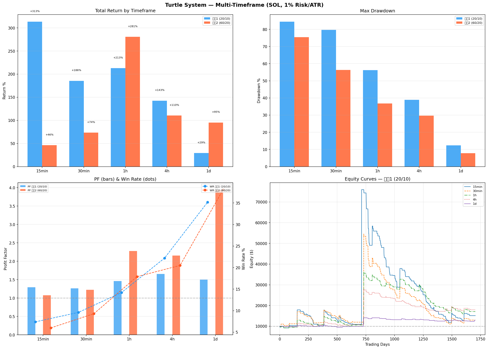

| K线 | 系统 | 交易 | 总收益% | 年化% | 夏普 | 胜率% | PF | 回撤% | Calmar |
|---:|---:|---:|---:|---:|---:|---:|---:|---:|---:|
| 15min | 系统1 (20/10) | 204 | +278.9 | +32.9 | 0.74 | 7.4 | 1.27 | -89.5 | 0.367 |
| 15min | 系统2 (60/20) | 120 | +22.2 | +4.5 | 0.41 | 5.0 | 1.03 | -87.3 | 0.051 |
| 30min | 系统1 (20/10) | 168 | +167.0 | +23.3 | 0.61 | 9.5 | 1.24 | -87.2 | 0.267 |
| 30min | 系统2 (60/20) | 88 | +53.9 | +9.9 | 0.45 | 8.0 | 1.16 | -75.2 | 0.131 |
| 1h | 系统1 (20/10) | 127 | +207.2 | +27.1 | 0.72 | 13.4 | 1.45 | -71.5 | 0.379 |
| 1h | 系统2 (60/20) | 56 | +281.3 | +34.0 | 0.83 | 17.9 | 2.27 | -59.8 | 0.568 |
| 4h | 系统1 (20/10) | 81 | +142.3 | +20.8 | 0.73 | 22.2 | 1.65 | -56.6 | 0.367 |
| 4h | 系统2 (60/20) | 39 | +111.5 | +17.8 | 0.69 | 20.5 | 2.16 | -50.8 | 0.350 |
| 1d | 系统1 (20/10) | 54 | +29.2 | +5.6 | 0.44 | 35.2 | 1.50 | -26.8 | 0.210 |
| 1d | 系统2 (60/20) | 21 | +95.9 | +15.8 | 0.93 | 38.1 | 3.95 | -21.9 | 0.722 |

### TRX

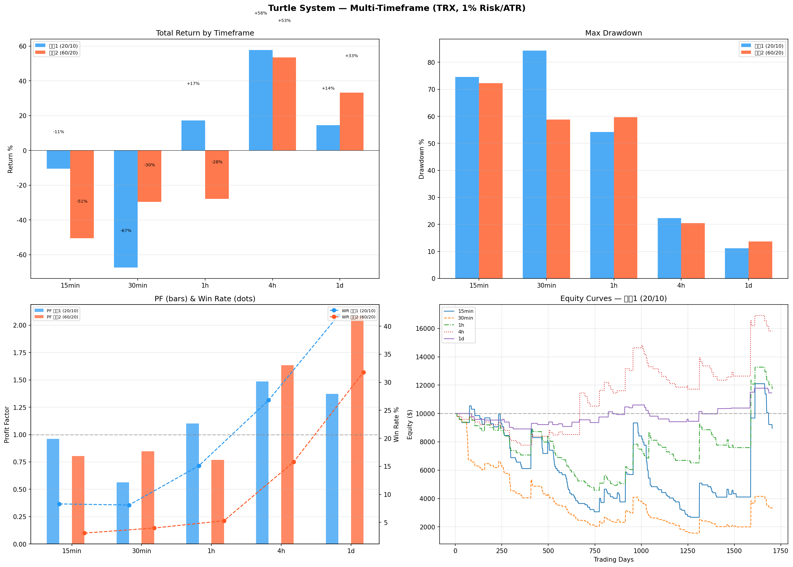

| K线 | 系统 | 交易 | 总收益% | 年化% | 夏普 | 胜率% | PF | 回撤% | Calmar |
|---:|---:|---:|---:|---:|---:|---:|---:|---:|---:|
| 15min | 系统1 (20/10) | 195 | -38.8 | -9.9 | 0.38 | 8.2 | 0.85 | -87.1 | -0.114 |
| 15min | 系统2 (60/20) | 127 | -59.4 | -17.9 | 0.23 | 3.1 | 0.76 | -89.1 | -0.201 |
| 30min | 系统1 (20/10) | 189 | -75.1 | -25.7 | 0.04 | 7.9 | 0.51 | -88.4 | -0.290 |
| 30min | 系统2 (60/20) | 100 | -36.3 | -9.4 | 0.24 | 4.0 | 0.81 | -80.9 | -0.116 |
| 1h | 系统1 (20/10) | 121 | +2.2 | +0.5 | 0.30 | 14.9 | 1.01 | -64.6 | 0.007 |
| 1h | 系统2 (60/20) | 78 | -39.5 | -10.4 | 0.15 | 3.8 | 0.69 | -73.2 | -0.142 |
| 4h | 系统1 (20/10) | 75 | +24.2 | +4.7 | 0.29 | 24.0 | 1.20 | -45.7 | 0.104 |
| 4h | 系统2 (60/20) | 38 | +51.2 | +9.5 | 0.36 | 15.8 | 1.60 | -54.4 | 0.174 |
| 1d | 系统1 (20/10) | 43 | +13.6 | +2.8 | 0.30 | 41.9 | 1.34 | -15.7 | 0.176 |
| 1d | 系统2 (60/20) | 22 | +32.7 | +6.4 | 0.34 | 31.8 | 2.06 | -32.2 | 0.198 |

### UNI

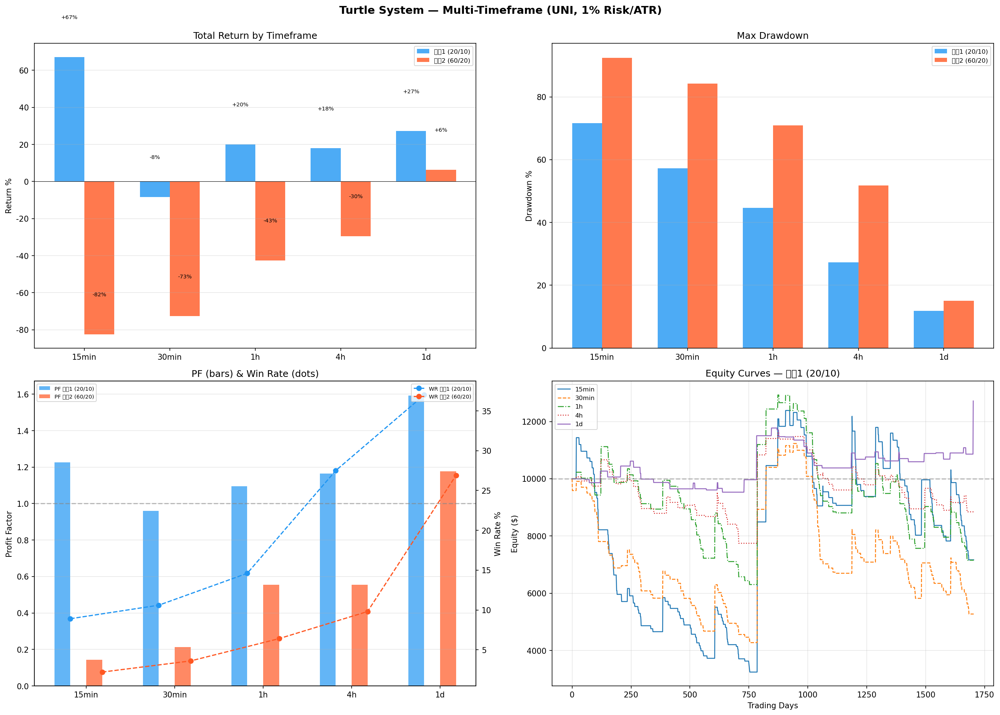

| K线 | 系统 | 交易 | 总收益% | 年化% | 夏普 | 胜率% | PF | 回撤% | Calmar |
|---:|---:|---:|---:|---:|---:|---:|---:|---:|---:|
| 15min | 系统1 (20/10) | 194 | +26.3 | +5.1 | 0.42 | 8.8 | 1.09 | -77.8 | 0.066 |
| 15min | 系统2 (60/20) | 136 | -86.0 | -34.9 | -0.53 | 2.2 | 0.11 | -94.0 | -0.371 |
| 30min | 系统1 (20/10) | 161 | -14.2 | -3.2 | 0.26 | 10.6 | 0.93 | -66.3 | -0.049 |
| 30min | 系统2 (60/20) | 110 | -74.0 | -25.5 | -0.55 | 3.6 | 0.20 | -86.5 | -0.295 |
| 1h | 系统1 (20/10) | 131 | +12.9 | +2.6 | 0.28 | 14.5 | 1.06 | -57.8 | 0.045 |
| 1h | 系统2 (60/20) | 78 | -44.0 | -11.9 | -0.26 | 6.4 | 0.54 | -75.3 | -0.158 |
| 4h | 系统1 (20/10) | 80 | +16.2 | +3.2 | 0.25 | 26.2 | 1.15 | -32.4 | 0.100 |
| 4h | 系统2 (60/20) | 51 | -30.2 | -7.6 | -0.32 | 9.8 | 0.55 | -55.6 | -0.136 |
| 1d | 系统1 (20/10) | 46 | +26.6 | +5.2 | 0.45 | 37.0 | 1.58 | -17.2 | 0.300 |
| 1d | 系统2 (60/20) | 26 | +6.0 | +1.3 | 0.16 | 26.9 | 1.17 | -26.5 | 0.048 |

### XLM

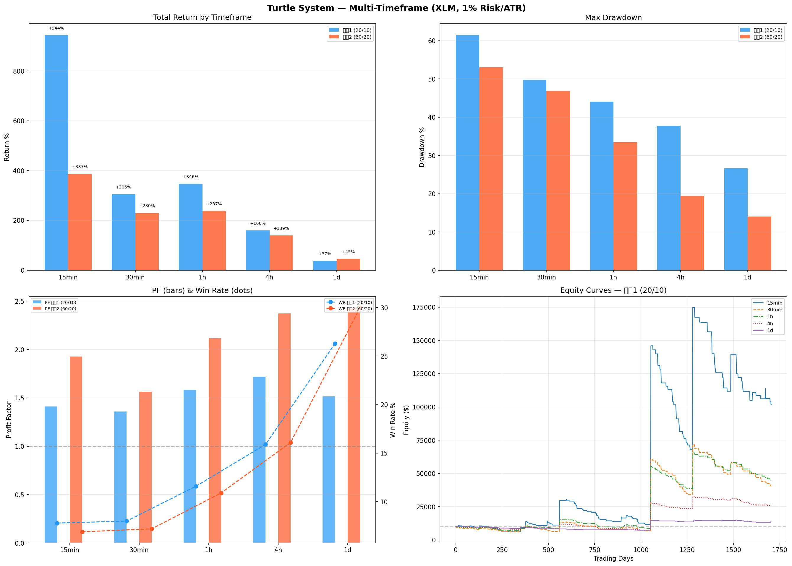

| K线 | 系统 | 交易 | 总收益% | 年化% | 夏普 | 胜率% | PF | 回撤% | Calmar |
|---:|---:|---:|---:|---:|---:|---:|---:|---:|---:|
| 15min | 系统1 (20/10) | 207 | +722.7 | +56.8 | 0.78 | 7.2 | 1.35 | -75.8 | 0.749 |
| 15min | 系统2 (60/20) | 78 | +168.8 | +24.1 | 0.60 | 5.1 | 1.65 | -74.6 | 0.323 |
| 30min | 系统1 (20/10) | 174 | +258.6 | +31.3 | 0.66 | 7.5 | 1.31 | -65.2 | 0.481 |
| 30min | 系统2 (60/20) | 70 | +165.8 | +23.8 | 0.59 | 5.7 | 1.47 | -73.8 | 0.323 |
| 1h | 系统1 (20/10) | 131 | +290.1 | +33.7 | 0.68 | 10.7 | 1.48 | -59.5 | 0.566 |
| 1h | 系统2 (60/20) | 47 | +225.1 | +29.4 | 0.67 | 10.6 | 2.02 | -59.5 | 0.494 |
| 4h | 系统1 (20/10) | 88 | +150.9 | +21.7 | 0.61 | 15.9 | 1.67 | -48.3 | 0.450 |
| 4h | 系统2 (60/20) | 31 | +137.6 | +20.8 | 0.60 | 16.1 | 2.35 | -56.5 | 0.369 |
| 1d | 系统1 (20/10) | 58 | +34.7 | +6.6 | 0.37 | 25.9 | 1.47 | -28.5 | 0.230 |
| 1d | 系统2 (60/20) | 21 | +41.0 | +7.8 | 0.41 | 28.6 | 2.15 | -32.7 | 0.239 |

### XRP

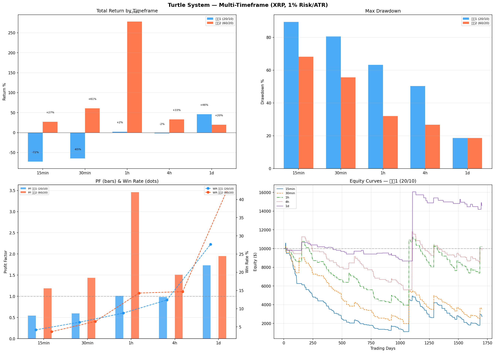

| K线 | 系统 | 交易 | 总收益% | 年化% | 夏普 | 胜率% | PF | 回撤% | Calmar |
|---:|---:|---:|---:|---:|---:|---:|---:|---:|---:|
| 15min | 系统1 (20/10) | 222 | -80.1 | -29.1 | -0.14 | 4.1 | 0.48 | -92.4 | -0.315 |
| 15min | 系统2 (60/20) | 81 | +19.9 | +4.0 | 0.37 | 3.7 | 1.14 | -71.2 | 0.057 |
| 30min | 系统1 (20/10) | 179 | -70.6 | -23.0 | -0.19 | 6.1 | 0.56 | -84.5 | -0.272 |
| 30min | 系统2 (60/20) | 62 | +55.5 | +10.1 | 0.44 | 6.5 | 1.40 | -64.2 | 0.158 |
| 1h | 系统1 (20/10) | 126 | -4.3 | -0.9 | 0.21 | 8.7 | 0.98 | -66.4 | -0.014 |
| 1h | 系统2 (60/20) | 43 | +247.2 | +31.3 | 0.76 | 14.0 | 3.07 | -50.5 | 0.619 |
| 4h | 系统1 (20/10) | 89 | -5.5 | -1.2 | 0.10 | 12.4 | 0.96 | -52.5 | -0.023 |
| 4h | 系统2 (60/20) | 34 | +32.2 | +6.3 | 0.35 | 14.7 | 1.50 | -36.4 | 0.173 |
| 1d | 系统1 (20/10) | 47 | +44.4 | +8.2 | 0.50 | 27.7 | 1.69 | -24.4 | 0.335 |
| 1d | 系统2 (60/20) | 19 | +19.4 | +4.0 | 0.31 | 42.1 | 1.94 | -22.6 | 0.175 |

---

## 二、跨币种横向对比

### 4h × 系统2 (60/20) (14 币种)

| 币种 | 交易 | 总收益% | 年化% | 夏普 | 胜率% | PF | 回撤% | Calmar |
|---:|---:|---:|---:|---:|---:|---:|---:|---:|
| ETH | 31 | +177.7 | +25.0 | 0.97 | 35.5 | 4.05 | -25.5 | 0.980 |
| XLM | 31 | +137.6 | +20.8 | 0.60 | 16.1 | 2.35 | -56.5 | 0.369 |
| BTC | 37 | +118.1 | +18.6 | 0.76 | 27.0 | 2.41 | -24.1 | 0.771 |
| SOL | 39 | +111.5 | +17.8 | 0.69 | 20.5 | 2.16 | -50.8 | 0.350 |
| NEAR | 42 | +88.3 | +14.8 | 0.61 | 21.4 | 2.07 | -48.6 | 0.305 |
| AVAX | 36 | +58.1 | +10.5 | 0.51 | 25.0 | 1.93 | -43.1 | 0.245 |
| TRX | 38 | +51.2 | +9.5 | 0.36 | 15.8 | 1.60 | -54.4 | 0.174 |
| XRP | 34 | +32.2 | +6.3 | 0.35 | 14.7 | 1.50 | -36.4 | 0.173 |
| LINK | 36 | +30.4 | +6.0 | 0.34 | 19.4 | 1.46 | -37.4 | 0.160 |
| ADA | 41 | +24.7 | +4.9 | 0.31 | 17.1 | 1.33 | -38.6 | 0.128 |
| DOGE | 39 | +13.2 | +2.8 | 0.24 | 12.8 | 1.17 | -47.7 | 0.058 |
| BCH | 47 | -11.8 | -2.7 | -0.02 | 8.5 | 0.86 | -53.1 | -0.051 |
| UNI | 51 | -30.2 | -7.6 | -0.32 | 9.8 | 0.55 | -55.6 | -0.136 |
| LTC | 47 | -41.2 | -10.9 | -0.67 | 10.6 | 0.39 | -55.2 | -0.198 |
| **中位数** | | | +7.9 | 0.36 | | 1.55 | -48.2 | 0.173 |
| **均值** | | | +8.3 | 0.34 | | 1.70 | -44.8 | 0.238 |

盈利币种: 11/14 (79%)

### 4h × 系统1 (20/10) (14 币种)

| 币种 | 交易 | 总收益% | 年化% | 夏普 | 胜率% | PF | 回撤% | Calmar |
|---:|---:|---:|---:|---:|---:|---:|---:|---:|
| AVAX | 73 | +181.4 | +24.7 | 0.90 | 23.3 | 2.10 | -26.4 | 0.937 |
| ETH | 71 | +178.1 | +24.4 | 0.94 | 26.8 | 2.11 | -33.4 | 0.732 |
| NEAR | 80 | +163.5 | +23.0 | 0.77 | 22.5 | 1.86 | -54.3 | 0.423 |
| XLM | 88 | +150.9 | +21.7 | 0.61 | 15.9 | 1.67 | -48.3 | 0.450 |
| SOL | 81 | +142.3 | +20.8 | 0.73 | 22.2 | 1.65 | -56.6 | 0.367 |
| ADA | 76 | +134.2 | +19.9 | 0.74 | 25.0 | 1.68 | -35.3 | 0.565 |
| BTC | 89 | +96.6 | +15.5 | 0.66 | 23.6 | 1.46 | -39.5 | 0.394 |
| DOGE | 75 | +92.6 | +15.0 | 0.57 | 18.7 | 1.58 | -43.4 | 0.346 |
| LINK | 80 | +28.8 | +5.6 | 0.33 | 21.2 | 1.20 | -42.7 | 0.130 |
| TRX | 75 | +24.2 | +4.7 | 0.29 | 24.0 | 1.20 | -45.7 | 0.104 |
| UNI | 80 | +16.2 | +3.2 | 0.25 | 26.2 | 1.15 | -32.4 | 0.100 |
| BCH | 82 | +7.0 | +1.5 | 0.20 | 18.3 | 1.04 | -56.2 | 0.026 |
| XRP | 89 | -5.5 | -1.2 | 0.10 | 12.4 | 0.96 | -52.5 | -0.023 |
| LTC | 97 | -61.1 | -18.2 | -0.81 | 12.4 | 0.39 | -69.3 | -0.263 |
| **中位数** | | | +15.3 | 0.59 | | 1.52 | -44.5 | 0.356 |
| **均值** | | | +11.5 | 0.45 | | 1.43 | -45.4 | 0.306 |

盈利币种: 12/14 (86%)

### 1h × 系统2 (60/20) (14 币种)

| 币种 | 交易 | 总收益% | 年化% | 夏普 | 胜率% | PF | 回撤% | Calmar |
|---:|---:|---:|---:|---:|---:|---:|---:|---:|
| ETH | 43 | +501.0 | +48.0 | 1.08 | 23.3 | 5.22 | -38.3 | 1.253 |
| SOL | 56 | +281.3 | +34.0 | 0.83 | 17.9 | 2.27 | -59.8 | 0.568 |
| XRP | 43 | +247.2 | +31.3 | 0.76 | 14.0 | 3.07 | -50.5 | 0.619 |
| XLM | 47 | +225.1 | +29.4 | 0.67 | 10.6 | 2.02 | -59.5 | 0.494 |
| BTC | 64 | +185.5 | +25.8 | 0.72 | 15.6 | 1.82 | -45.5 | 0.567 |
| ADA | 56 | +105.4 | +17.0 | 0.57 | 14.3 | 1.69 | -51.8 | 0.329 |
| AVAX | 59 | +68.5 | +12.1 | 0.47 | 10.2 | 1.58 | -54.8 | 0.220 |
| LINK | 62 | +1.7 | +0.4 | 0.21 | 9.7 | 1.01 | -56.8 | 0.006 |
| NEAR | 78 | -33.1 | -8.4 | -0.02 | 9.0 | 0.68 | -63.5 | -0.132 |
| BCH | 69 | -38.0 | -9.9 | -0.09 | 4.3 | 0.66 | -73.5 | -0.135 |
| TRX | 78 | -39.5 | -10.4 | 0.15 | 3.8 | 0.69 | -73.2 | -0.142 |
| UNI | 78 | -44.0 | -11.9 | -0.26 | 6.4 | 0.54 | -75.3 | -0.158 |
| LTC | 76 | -62.1 | -19.1 | -0.61 | 6.6 | 0.42 | -75.2 | -0.254 |
| DOGE | 77 | -73.6 | -25.2 | -0.50 | 1.3 | 0.14 | -86.8 | -0.291 |
| **中位数** | | | +6.2 | 0.34 | | 1.30 | -59.7 | 0.113 |
| **均值** | | | +8.1 | 0.28 | | 1.56 | -61.8 | 0.210 |

盈利币种: 8/14 (57%)

### 1d × 系统2 (60/20) (14 币种)

| 币种 | 交易 | 总收益% | 年化% | 夏普 | 胜率% | PF | 回撤% | Calmar |
|---:|---:|---:|---:|---:|---:|---:|---:|---:|
| SOL | 21 | +95.9 | +15.8 | 0.93 | 38.1 | 3.95 | -21.9 | 0.722 |
| NEAR | 22 | +51.8 | +9.6 | 0.68 | 40.9 | 3.11 | -27.7 | 0.345 |
| XLM | 21 | +41.0 | +7.8 | 0.41 | 28.6 | 2.15 | -32.7 | 0.239 |
| AVAX | 23 | +38.8 | +7.4 | 0.60 | 43.5 | 2.54 | -24.1 | 0.309 |
| ADA | 20 | +38.5 | +7.4 | 0.51 | 40.0 | 2.48 | -22.5 | 0.328 |
| ETH | 22 | +34.7 | +6.7 | 0.59 | 40.9 | 2.83 | -15.4 | 0.437 |
| TRX | 22 | +32.7 | +6.4 | 0.34 | 31.8 | 2.06 | -32.2 | 0.198 |
| BTC | 24 | +21.0 | +4.2 | 0.43 | 37.5 | 1.76 | -12.0 | 0.355 |
| XRP | 19 | +19.4 | +4.0 | 0.31 | 42.1 | 1.94 | -22.6 | 0.175 |
| BCH | 20 | +13.8 | +2.9 | 0.33 | 25.0 | 1.45 | -17.9 | 0.161 |
| UNI | 26 | +6.0 | +1.3 | 0.16 | 26.9 | 1.17 | -26.5 | 0.048 |
| DOGE | 25 | +6.0 | +1.3 | 0.16 | 28.0 | 1.17 | -30.5 | 0.042 |
| LINK | 27 | -2.2 | -0.5 | 0.04 | 29.6 | 0.93 | -22.1 | -0.022 |
| LTC | 24 | -7.2 | -1.6 | -0.07 | 25.0 | 0.76 | -19.2 | -0.085 |
| **中位数** | | | +5.3 | 0.38 | | 2.00 | -22.5 | 0.218 |
| **均值** | | | +5.2 | 0.39 | | 2.02 | -23.4 | 0.232 |

盈利币种: 12/14 (86%)

### 15min × 系统2 (60/20) (14 币种)

| 币种 | 交易 | 总收益% | 年化% | 夏普 | 胜率% | PF | 回撤% | Calmar |
|---:|---:|---:|---:|---:|---:|---:|---:|---:|
| ETH | 58 | +1107.7 | +72.4 | 1.07 | 15.5 | 6.35 | -58.6 | 1.234 |
| BTC | 96 | +549.4 | +50.5 | 0.89 | 10.4 | 1.77 | -55.0 | 0.918 |
| BCH | 80 | +186.2 | +25.8 | 0.63 | 6.2 | 1.61 | -75.5 | 0.342 |
| XLM | 78 | +168.8 | +24.1 | 0.60 | 5.1 | 1.65 | -74.6 | 0.323 |
| ADA | 109 | +63.5 | +11.3 | 0.47 | 6.4 | 1.18 | -70.2 | 0.162 |
| SOL | 120 | +22.2 | +4.5 | 0.41 | 5.0 | 1.03 | -87.3 | 0.051 |
| XRP | 81 | +19.9 | +4.0 | 0.37 | 3.7 | 1.14 | -71.2 | 0.057 |
| AVAX | 136 | -49.2 | -13.8 | 0.09 | 4.4 | 0.68 | -77.2 | -0.178 |
| LINK | 100 | -52.3 | -14.9 | 0.06 | 5.0 | 0.54 | -78.8 | -0.189 |
| TRX | 127 | -59.4 | -17.9 | 0.23 | 3.1 | 0.76 | -89.1 | -0.201 |
| NEAR | 132 | -65.6 | -20.8 | -0.00 | 5.3 | 0.43 | -85.2 | -0.244 |
| LTC | 108 | -76.8 | -27.3 | -0.38 | 3.7 | 0.46 | -89.7 | -0.305 |
| UNI | 136 | -86.0 | -34.9 | -0.53 | 2.2 | 0.11 | -94.0 | -0.371 |
| DOGE | 120 | -87.7 | -36.8 | -0.34 | 0.8 | 0.13 | -95.9 | -0.384 |
| **中位数** | | | -4.9 | 0.30 | | 0.90 | -78.0 | -0.064 |
| **均值** | | | +1.9 | 0.26 | | 1.27 | -78.7 | 0.087 |

盈利币种: 7/14 (50%)

### 30min × 系统2 (60/20) (14 币种)

| 币种 | 交易 | 总收益% | 年化% | 夏普 | 胜率% | PF | 回撤% | Calmar |
|---:|---:|---:|---:|---:|---:|---:|---:|---:|
| BTC | 77 | +356.7 | +39.4 | 0.84 | 13.0 | 1.93 | -52.5 | 0.750 |
| ETH | 62 | +258.6 | +32.2 | 0.78 | 14.5 | 2.92 | -54.1 | 0.595 |
| XLM | 70 | +165.8 | +23.8 | 0.59 | 5.7 | 1.47 | -73.8 | 0.323 |
| ADA | 76 | +114.7 | +18.2 | 0.57 | 9.2 | 1.48 | -60.6 | 0.300 |
| AVAX | 94 | +75.5 | +13.1 | 0.49 | 7.4 | 1.30 | -76.3 | 0.171 |
| LINK | 69 | +59.5 | +10.7 | 0.45 | 10.1 | 1.40 | -57.7 | 0.186 |
| XRP | 62 | +55.5 | +10.1 | 0.44 | 6.5 | 1.40 | -64.2 | 0.158 |
| SOL | 88 | +53.9 | +9.9 | 0.45 | 8.0 | 1.16 | -75.2 | 0.131 |
| TRX | 100 | -36.3 | -9.4 | 0.24 | 4.0 | 0.81 | -80.9 | -0.116 |
| NEAR | 106 | -43.3 | -11.7 | 0.03 | 7.5 | 0.67 | -71.9 | -0.162 |
| BCH | 84 | -43.6 | -11.8 | -0.01 | 3.6 | 0.67 | -79.9 | -0.147 |
| UNI | 110 | -74.0 | -25.5 | -0.55 | 3.6 | 0.20 | -86.5 | -0.295 |
| LTC | 96 | -74.7 | -25.9 | -0.63 | 4.2 | 0.40 | -85.4 | -0.304 |
| DOGE | 90 | -78.8 | -28.8 | -0.38 | 1.1 | 0.14 | -91.2 | -0.315 |
| **中位数** | | | +10.0 | 0.44 | | 1.23 | -74.5 | 0.145 |
| **均值** | | | +3.2 | 0.23 | | 1.14 | -72.2 | 0.091 |

盈利币种: 8/14 (57%)

---

## 三、每个币种的最佳组合

| 币种 | 最佳周期 | 最佳系统 | 年化% | PF | 回撤% | Calmar |
|---:|---:|---:|---:|---:|---:|---:|
| ETH | 15min | 系统1 (20/10) | +97.4 | 2.17 | -65.5 | 1.488 |
| BTC | 15min | 系统1 (20/10) | +82.7 | 1.61 | -68.4 | 1.209 |
| AVAX | 4h | 系统1 (20/10) | +24.7 | 2.10 | -26.4 | 0.937 |
| XLM | 15min | 系统1 (20/10) | +56.8 | 1.35 | -75.8 | 0.749 |
| SOL | 1d | 系统2 (60/20) | +15.8 | 3.95 | -21.9 | 0.722 |
| XRP | 1h | 系统2 (60/20) | +31.3 | 3.07 | -50.5 | 0.619 |
| ADA | 4h | 系统1 (20/10) | +19.9 | 1.68 | -35.3 | 0.565 |
| DOGE | 1d | 系统1 (20/10) | +9.1 | 2.34 | -20.1 | 0.451 |
| NEAR | 4h | 系统1 (20/10) | +23.0 | 1.86 | -54.3 | 0.423 |
| BCH | 15min | 系统2 (60/20) | +25.8 | 1.61 | -75.5 | 0.342 |
| UNI | 1d | 系统1 (20/10) | +5.2 | 1.58 | -17.2 | 0.300 |
| TRX | 1d | 系统2 (60/20) | +6.4 | 2.06 | -32.2 | 0.198 |
| LINK | 30min | 系统2 (60/20) | +10.7 | 1.40 | -57.7 | 0.186 |
| LTC | 1d | 系统1 (20/10) | -1.8 | 0.83 | -32.7 | -0.056 |

### 最佳组合频率分布

**时间框架**: 1d = 5次, 15min = 4次, 4h = 3次, 1h = 1次, 30min = 1次  
**系统参数**: 系统1 (20/10) = 9次, 系统2 (60/20) = 5次

---

## 四、组合层面 (各币种等权, 参考 TSMOM 论文的 diversified 组合)

| 组合 | 品种数 | 年化收益% | 年化波动% | 夏普 | Sortino | 最大回撤% | Calmar | 平均相关性 |
|---|---:|---:|---:|---:|---:|---:|---:|---:|
| 15min 系统1 (20/10) | 14 | +37.5 | 45.4 | 0.92 | 1.44 | -50.4 | 0.74 | 0.21 |
| 15min 系统2 (60/20) | 14 | +18.0 | 34.7 | 0.65 | 0.86 | -37.5 | 0.48 | 0.16 |
| 30min 系统1 (20/10) | 14 | +17.9 | 34.3 | 0.65 | 0.99 | -36.4 | 0.49 | 0.21 |
| 30min 系统2 (60/20) | 14 | +14.0 | 26.8 | 0.62 | 0.84 | -28.2 | 0.50 | 0.16 |
| 1h 系统1 (20/10) | 14 | +17.2 | 28.5 | 0.70 | 1.03 | -33.2 | 0.52 | 0.24 |
| 1h 系统2 (60/20) | 14 | +14.4 | 22.7 | 0.71 | 0.92 | -25.4 | 0.57 | 0.19 |
| 4h 系统1 (20/10) | 14 | +14.6 | 18.0 | 0.85 | 1.18 | -22.7 | 0.64 | 0.27 |
| 4h 系统2 (60/20) | 14 | +11.5 | 15.6 | 0.77 | 0.99 | -24.1 | 0.48 | 0.23 |
| 1d 系统1 (20/10) | 14 | +6.2 | 8.9 | 0.72 | 0.92 | -11.1 | 0.56 | 0.29 |
| 1d 系统2 (60/20) | 14 | +6.1 | 8.5 | 0.74 | 0.90 | -10.9 | 0.56 | 0.25 |

### 主组合: 4h × 系统2 (60/20)

#### 组合表现 (4h 系统2 (60/20); 14 个品种等权, 2022-03-03 ~ 2026-09-28)

| 指标 | 海龟组合 | 基准: 等权买入持有 |
|---|---:|---:|
| 年化收益 % | +11.5 | +9.8 |
| 年化波动 % | 15.6 | 66.2 |
| 夏普 | 0.77 | 0.47 |
| Sortino | 0.99 | 0.66 |
| 最大回撤 % | -24.1 | -70.1 |
| Calmar | 0.48 | 0.14 |

品种间日收益平均相关性: 0.23  (越低, 分散化降波动的效果越好)

| 年份 | 海龟组合 | 等权持有 |
|---|---:|---:|
| 2022 | +5.2% | -63.7% |
| 2023 | +20.2% | +156.3% |
| 2024 | +21.5% | +120.4% |
| 2025 | -8.1% | -30.5% |
| 2026 | +16.5% | +7.4% |

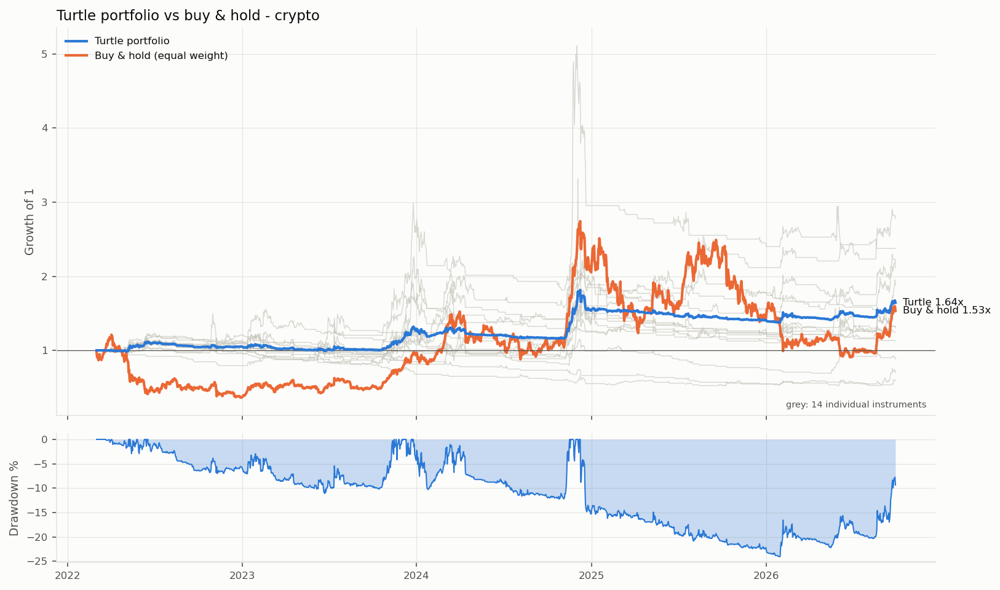

#### 风险特征 (月度回归, 括号内为 Newey-West t 值)

| 回归 | α (月) | 基准收益 | 基准收益² | 基准波动率 | 高波动哑变量 | R² |
|---|---:|---:|---:|---:|---:|---:|
| CAPM | 0.55% (1.05) | 0.177 (2.48) | | | | 0.46 |
| Smile | | 0.050 (1.20) | 0.294 (7.24) | | | 0.75 |
| 波动率状态 | | | | -0.054 (-1.06) | 5.76% (1.33) | 0.08 |

样本 55 个月。读法:
- **CAPM α**: 月均 0.55% (年化约 6.6%), t = 1.05。不显著, 收益大部分可由被动做多解释。
- **Smile**: 基准收益平方项 t = 7.24。显著为正: 大涨大跌时都赚钱, 类似 TSMOM 的 smile。
- **波动率状态**: 基准波动率 t = -1.06, 高波动哑变量 t = 1.33。与市场波动率状态关系不显著 (这也说明按波动率择时的 GARCH 过滤器改善空间有限)。
- CAPM 的截距是 α (基准是可交易的等权持有组合); Smile 和波动率回归的截距没有 α 含义, 不报告。
- 高波动阈值用全样本 80% 分位数, 是描述性分析, 不能直接当交易规则。

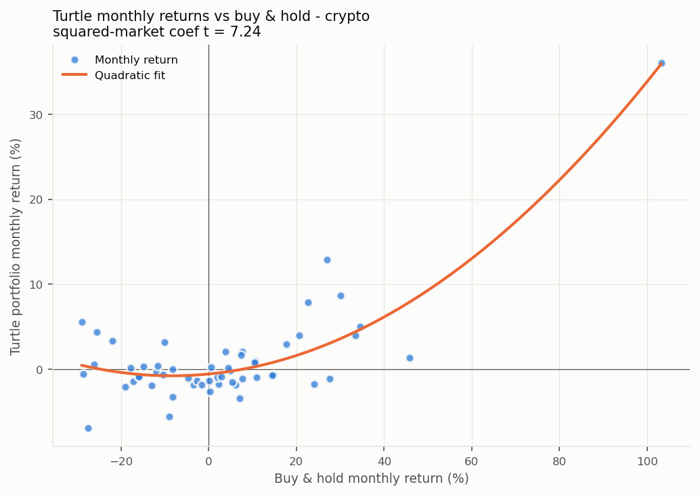
