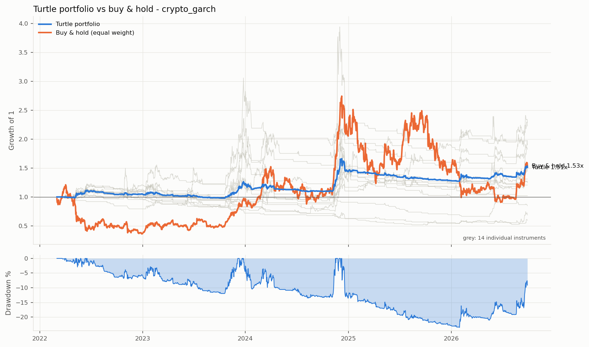
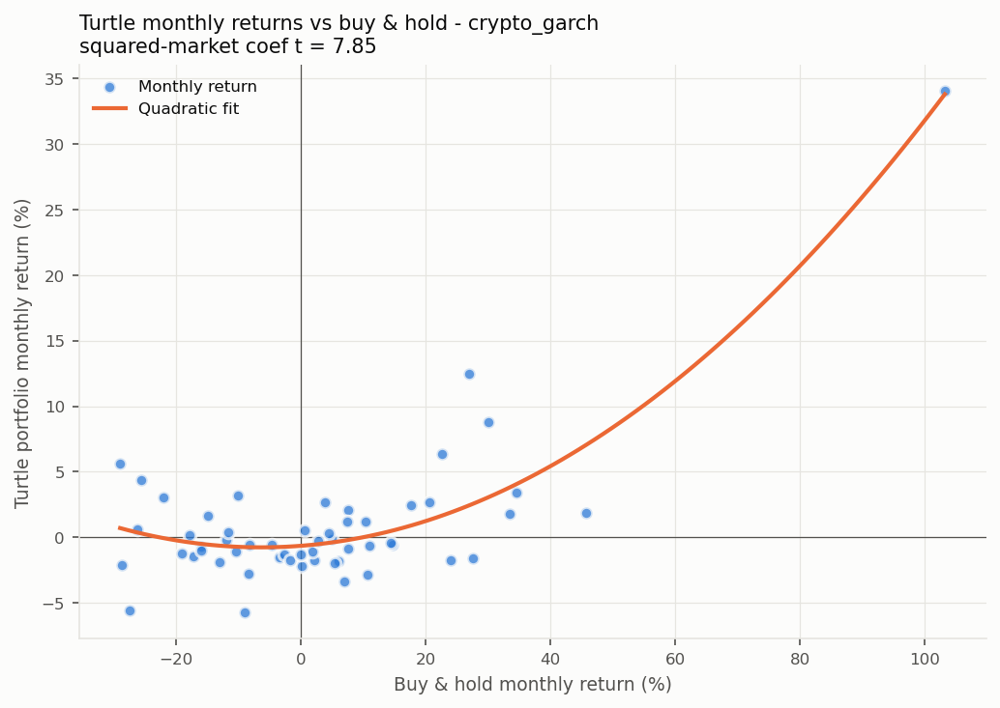

# 海龟交易系统 — 多币种稳健性回测报告

> 生成时间: 2026-09-28 17:44  
> 回测区间: 2022-01-01 ~ 今  
> 仓位: 1% 资金/ATR | 止损: 2N | 手续费: 0.05% | 滑点: 3‱/次 | 权益逐根盯市, 止损跳空按开盘价  
> 币种数: 14 个成功, 6 个跳过 (BNB, ZEC, HYPE, CC, HBAR, SUI)

---

## 一、各币种详细回测

### ADA

| K线 | 系统 | 交易 | 总收益% | 年化% | 夏普 | 胜率% | PF | 回撤% | Calmar |
|---:|---:|---:|---:|---:|---:|---:|---:|---:|---:|
| 15min | 系统1 (20/10) | 177 | +262.5 | +31.6 | 0.74 | 6.2 | 1.22 | -72.3 | 0.437 |
| 15min | 系统2 (60/20) | 114 | -29.3 | -7.3 | 0.19 | 6.1 | 0.86 | -76.3 | -0.096 |
| 30min | 系统1 (20/10) | 137 | +278.4 | +32.8 | 0.77 | 8.0 | 1.32 | -61.8 | 0.532 |
| 30min | 系统2 (60/20) | 82 | +9.3 | +2.0 | 0.28 | 8.5 | 1.05 | -62.5 | 0.031 |
| 1h | 系统1 (20/10) | 99 | +295.8 | +34.1 | 0.83 | 15.2 | 1.57 | -51.2 | 0.667 |
| 1h | 系统2 (60/20) | 52 | +120.2 | +18.8 | 0.61 | 15.4 | 1.82 | -50.8 | 0.371 |
| 4h | 系统1 (20/10) | 61 | +127.9 | +19.2 | 0.73 | 26.2 | 1.78 | -41.7 | 0.461 |
| 4h | 系统2 (60/20) | 38 | +31.0 | +6.1 | 0.36 | 18.4 | 1.44 | -37.6 | 0.162 |
| 1d | 系统1 (20/10) | 39 | +53.1 | +9.5 | 0.75 | 35.9 | 1.98 | -17.7 | 0.537 |
| 1d | 系统2 (60/20) | 17 | +39.7 | +7.6 | 0.53 | 41.2 | 2.74 | -22.8 | 0.332 |

### AVAX

| K线 | 系统 | 交易 | 总收益% | 年化% | 夏普 | 胜率% | PF | 回撤% | Calmar |
|---:|---:|---:|---:|---:|---:|---:|---:|---:|---:|
| 15min | 系统1 (20/10) | 179 | +709.8 | +56.3 | 0.89 | 10.6 | 1.56 | -62.0 | 0.907 |
| 15min | 系统2 (60/20) | 128 | -44.1 | -11.9 | 0.11 | 4.7 | 0.72 | -75.3 | -0.158 |
| 30min | 系统1 (20/10) | 141 | +254.3 | +31.0 | 0.71 | 9.9 | 1.50 | -64.2 | 0.482 |
| 30min | 系统2 (60/20) | 89 | +61.1 | +11.0 | 0.45 | 7.9 | 1.24 | -73.5 | 0.149 |
| 1h | 系统1 (20/10) | 99 | +310.1 | +35.1 | 0.86 | 15.2 | 1.97 | -40.5 | 0.868 |
| 1h | 系统2 (60/20) | 52 | +88.3 | +14.8 | 0.54 | 11.5 | 1.79 | -55.1 | 0.269 |
| 4h | 系统1 (20/10) | 62 | +120.5 | +18.4 | 0.75 | 19.4 | 2.00 | -32.5 | 0.566 |
| 4h | 系统2 (60/20) | 37 | +44.2 | +8.3 | 0.44 | 18.9 | 1.66 | -49.2 | 0.169 |
| 1d | 系统1 (20/10) | 37 | +24.1 | +4.7 | 0.45 | 35.1 | 1.59 | -18.4 | 0.257 |
| 1d | 系统2 (60/20) | 21 | +17.9 | +3.7 | 0.37 | 38.1 | 1.80 | -20.4 | 0.180 |

### BCH

| K线 | 系统 | 交易 | 总收益% | 年化% | 夏普 | 胜率% | PF | 回撤% | Calmar |
|---:|---:|---:|---:|---:|---:|---:|---:|---:|---:|
| 15min | 系统1 (20/10) | 191 | -7.1 | -1.6 | 0.36 | 4.7 | 0.99 | -95.7 | -0.016 |
| 15min | 系统2 (60/20) | 83 | +85.6 | +14.5 | 0.50 | 4.8 | 1.31 | -83.2 | 0.174 |
| 30min | 系统1 (20/10) | 154 | -75.0 | -25.6 | -0.25 | 4.5 | 0.64 | -93.0 | -0.275 |
| 30min | 系统2 (60/20) | 75 | -31.1 | -7.8 | 0.07 | 4.0 | 0.76 | -75.4 | -0.104 |
| 1h | 系统1 (20/10) | 114 | -49.4 | -13.5 | -0.14 | 8.8 | 0.72 | -85.0 | -0.159 |
| 1h | 系统2 (60/20) | 62 | -28.8 | -7.2 | -0.06 | 4.8 | 0.73 | -68.6 | -0.104 |
| 4h | 系统1 (20/10) | 69 | -16.2 | -3.7 | -0.02 | 15.9 | 0.86 | -64.1 | -0.058 |
| 4h | 系统2 (60/20) | 43 | -15.1 | -3.5 | -0.08 | 7.0 | 0.81 | -56.7 | -0.062 |
| 1d | 系统1 (20/10) | 33 | +12.4 | +2.5 | 0.30 | 36.4 | 1.36 | -15.2 | 0.165 |
| 1d | 系统2 (60/20) | 16 | +8.1 | +1.7 | 0.25 | 31.2 | 1.37 | -13.7 | 0.126 |

### BTC

| K线 | 系统 | 交易 | 总收益% | 年化% | 夏普 | 胜率% | PF | 回撤% | Calmar |
|---:|---:|---:|---:|---:|---:|---:|---:|---:|---:|
| 15min | 系统1 (20/10) | 164 | +1996.3 | +91.4 | 1.16 | 10.4 | 1.73 | -62.5 | 1.464 |
| 15min | 系统2 (60/20) | 93 | +585.5 | +52.3 | 0.91 | 10.8 | 1.79 | -55.6 | 0.941 |
| 30min | 系统1 (20/10) | 130 | +641.8 | +53.4 | 0.97 | 10.8 | 1.73 | -65.4 | 0.816 |
| 30min | 系统2 (60/20) | 76 | +229.1 | +29.7 | 0.72 | 11.8 | 1.68 | -54.2 | 0.548 |
| 1h | 系统1 (20/10) | 107 | +378.4 | +39.7 | 0.93 | 15.0 | 1.81 | -54.1 | 0.733 |
| 1h | 系统2 (60/20) | 56 | +194.7 | +26.6 | 0.74 | 16.1 | 1.97 | -39.1 | 0.682 |
| 4h | 系统1 (20/10) | 67 | +124.4 | +18.8 | 0.79 | 29.9 | 1.86 | -30.7 | 0.614 |
| 4h | 系统2 (60/20) | 32 | +129.0 | +19.9 | 0.81 | 31.2 | 2.84 | -23.2 | 0.855 |
| 1d | 系统1 (20/10) | 41 | +14.3 | +2.9 | 0.32 | 31.7 | 1.29 | -16.6 | 0.174 |
| 1d | 系统2 (60/20) | 22 | +10.1 | +2.1 | 0.26 | 31.8 | 1.35 | -12.8 | 0.166 |

### DOGE

| K线 | 系统 | 交易 | 总收益% | 年化% | 夏普 | 胜率% | PF | 回撤% | Calmar |
|---:|---:|---:|---:|---:|---:|---:|---:|---:|---:|
| 15min | 系统1 (20/10) | 183 | -7.6 | -1.7 | 0.39 | 3.8 | 0.99 | -88.2 | -0.019 |
| 15min | 系统2 (60/20) | 124 | -88.8 | -38.0 | -0.39 | 0.8 | 0.13 | -96.2 | -0.395 |
| 30min | 系统1 (20/10) | 130 | +48.8 | +8.8 | 0.45 | 8.5 | 1.10 | -78.5 | 0.113 |
| 30min | 系统2 (60/20) | 87 | -77.3 | -27.7 | -0.36 | 1.1 | 0.16 | -90.6 | -0.305 |
| 1h | 系统1 (20/10) | 102 | +73.2 | +12.4 | 0.47 | 11.8 | 1.25 | -61.4 | 0.203 |
| 1h | 系统2 (60/20) | 75 | -72.4 | -24.5 | -0.50 | 1.3 | 0.14 | -86.1 | -0.284 |
| 4h | 系统1 (20/10) | 62 | +104.5 | +16.5 | 0.61 | 21.0 | 1.79 | -43.2 | 0.382 |
| 4h | 系统2 (60/20) | 36 | +20.6 | +4.2 | 0.28 | 13.9 | 1.28 | -46.6 | 0.090 |
| 1d | 系统1 (20/10) | 39 | +6.6 | +1.4 | 0.17 | 28.2 | 1.17 | -27.8 | 0.050 |
| 1d | 系统2 (60/20) | 22 | +11.9 | +2.5 | 0.24 | 31.8 | 1.38 | -27.6 | 0.091 |

### ETH

| K线 | 系统 | 交易 | 总收益% | 年化% | 夏普 | 胜率% | PF | 回撤% | Calmar |
|---:|---:|---:|---:|---:|---:|---:|---:|---:|---:|
| 15min | 系统1 (20/10) | 148 | +1752.6 | +86.5 | 1.12 | 11.5 | 1.76 | -59.2 | 1.460 |
| 15min | 系统2 (60/20) | 66 | +636.6 | +54.7 | 0.94 | 12.1 | 3.55 | -59.7 | 0.916 |
| 30min | 系统1 (20/10) | 131 | +692.5 | +55.5 | 1.04 | 13.7 | 1.68 | -54.2 | 1.024 |
| 30min | 系统2 (60/20) | 68 | +140.0 | +21.1 | 0.62 | 11.8 | 1.91 | -57.2 | 0.369 |
| 1h | 系统1 (20/10) | 93 | +613.8 | +52.1 | 1.09 | 21.5 | 2.22 | -39.2 | 1.331 |
| 1h | 系统2 (60/20) | 44 | +224.6 | +29.3 | 0.82 | 22.7 | 3.45 | -42.2 | 0.696 |
| 4h | 系统1 (20/10) | 57 | +170.9 | +23.7 | 0.96 | 28.1 | 2.24 | -26.3 | 0.902 |
| 4h | 系统2 (60/20) | 31 | +82.4 | +14.0 | 0.68 | 32.3 | 2.76 | -28.9 | 0.487 |
| 1d | 系统1 (20/10) | 32 | +0.6 | +0.1 | 0.06 | 34.4 | 1.02 | -12.8 | 0.009 |
| 1d | 系统2 (60/20) | 20 | -1.4 | -0.3 | 0.02 | 40.0 | 0.93 | -12.2 | -0.025 |

### LINK

| K线 | 系统 | 交易 | 总收益% | 年化% | 夏普 | 胜率% | PF | 回撤% | Calmar |
|---:|---:|---:|---:|---:|---:|---:|---:|---:|---:|
| 15min | 系统1 (20/10) | 201 | -26.5 | -6.3 | 0.30 | 6.5 | 0.90 | -79.9 | -0.079 |
| 15min | 系统2 (60/20) | 103 | -55.5 | -16.2 | 0.01 | 4.9 | 0.51 | -80.7 | -0.201 |
| 30min | 系统1 (20/10) | 158 | +14.2 | +2.9 | 0.33 | 9.5 | 1.05 | -71.7 | 0.040 |
| 30min | 系统2 (60/20) | 69 | +54.8 | +10.0 | 0.44 | 10.1 | 1.37 | -57.7 | 0.174 |
| 1h | 系统1 (20/10) | 132 | -36.1 | -9.1 | 0.02 | 9.1 | 0.81 | -65.8 | -0.139 |
| 1h | 系统2 (60/20) | 59 | +7.0 | +1.5 | 0.23 | 10.2 | 1.06 | -54.9 | 0.027 |
| 4h | 系统1 (20/10) | 62 | +37.4 | +7.0 | 0.37 | 24.2 | 1.32 | -44.5 | 0.158 |
| 4h | 系统2 (60/20) | 33 | +24.7 | +4.9 | 0.31 | 21.2 | 1.42 | -36.0 | 0.137 |
| 1d | 系统1 (20/10) | 36 | +32.5 | +6.2 | 0.51 | 44.4 | 2.08 | -18.1 | 0.342 |
| 1d | 系统2 (60/20) | 23 | -3.2 | -0.7 | 0.02 | 26.1 | 0.88 | -21.6 | -0.033 |

### LTC

| K线 | 系统 | 交易 | 总收益% | 年化% | 夏普 | 胜率% | PF | 回撤% | Calmar |
|---:|---:|---:|---:|---:|---:|---:|---:|---:|---:|
| 15min | 系统1 (20/10) | 230 | -97.6 | -54.8 | -1.03 | 2.2 | 0.36 | -99.0 | -0.553 |
| 15min | 系统2 (60/20) | 103 | -77.5 | -27.8 | -0.43 | 2.9 | 0.44 | -90.0 | -0.309 |
| 30min | 系统1 (20/10) | 184 | -94.7 | -46.5 | -1.24 | 2.7 | 0.34 | -97.2 | -0.479 |
| 30min | 系统2 (60/20) | 89 | -73.9 | -25.4 | -0.67 | 3.4 | 0.39 | -85.1 | -0.299 |
| 1h | 系统1 (20/10) | 138 | -86.4 | -34.7 | -1.12 | 5.1 | 0.34 | -91.8 | -0.378 |
| 1h | 系统2 (60/20) | 70 | -60.8 | -18.5 | -0.62 | 5.7 | 0.41 | -74.1 | -0.249 |
| 4h | 系统1 (20/10) | 76 | -48.6 | -13.3 | -0.61 | 13.2 | 0.45 | -60.4 | -0.220 |
| 4h | 系统2 (60/20) | 42 | -40.3 | -10.7 | -0.78 | 9.5 | 0.35 | -54.0 | -0.198 |
| 1d | 系统1 (20/10) | 32 | +10.9 | +2.2 | 0.24 | 31.2 | 1.35 | -23.6 | 0.095 |
| 1d | 系统2 (60/20) | 18 | +0.5 | +0.1 | 0.07 | 27.8 | 1.02 | -15.9 | 0.007 |

### NEAR

| K线 | 系统 | 交易 | 总收益% | 年化% | 夏普 | 胜率% | PF | 回撤% | Calmar |
|---:|---:|---:|---:|---:|---:|---:|---:|---:|---:|
| 15min | 系统1 (20/10) | 259 | -93.1 | -43.5 | -0.37 | 5.0 | 0.45 | -97.9 | -0.445 |
| 15min | 系统2 (60/20) | 131 | -73.0 | -24.9 | -0.10 | 4.6 | 0.35 | -88.4 | -0.282 |
| 30min | 系统1 (20/10) | 191 | -67.9 | -21.5 | -0.12 | 7.9 | 0.67 | -85.0 | -0.253 |
| 30min | 系统2 (60/20) | 94 | -28.8 | -7.1 | 0.12 | 8.5 | 0.77 | -64.7 | -0.110 |
| 1h | 系统1 (20/10) | 145 | -63.0 | -19.1 | -0.24 | 8.3 | 0.64 | -82.1 | -0.233 |
| 1h | 系统2 (60/20) | 72 | -26.0 | -6.4 | 0.04 | 9.7 | 0.73 | -59.6 | -0.107 |
| 4h | 系统1 (20/10) | 62 | +184.9 | +25.0 | 0.84 | 27.4 | 2.23 | -51.9 | 0.483 |
| 4h | 系统2 (60/20) | 36 | +90.3 | +15.1 | 0.62 | 22.2 | 2.24 | -49.8 | 0.303 |
| 1d | 系统1 (20/10) | 35 | +49.3 | +8.9 | 0.61 | 42.9 | 2.09 | -36.7 | 0.244 |
| 1d | 系统2 (60/20) | 20 | +39.5 | +7.6 | 0.56 | 35.0 | 2.95 | -26.9 | 0.281 |

### SOL

| K线 | 系统 | 交易 | 总收益% | 年化% | 夏普 | 胜率% | PF | 回撤% | Calmar |
|---:|---:|---:|---:|---:|---:|---:|---:|---:|---:|
| 15min | 系统1 (20/10) | 195 | +328.8 | +36.4 | 0.77 | 7.2 | 1.32 | -89.2 | 0.408 |
| 15min | 系统2 (60/20) | 112 | +46.6 | +8.7 | 0.46 | 5.4 | 1.08 | -84.4 | 0.103 |
| 30min | 系统1 (20/10) | 151 | +186.9 | +25.2 | 0.63 | 9.3 | 1.26 | -84.5 | 0.299 |
| 30min | 系统2 (60/20) | 85 | +59.2 | +10.7 | 0.45 | 7.1 | 1.17 | -75.4 | 0.142 |
| 1h | 系统1 (20/10) | 118 | +159.2 | +22.5 | 0.66 | 11.0 | 1.39 | -79.0 | 0.286 |
| 1h | 系统2 (60/20) | 54 | +275.7 | +33.5 | 0.84 | 16.7 | 2.32 | -60.4 | 0.555 |
| 4h | 系统1 (20/10) | 66 | +124.1 | +18.8 | 0.71 | 22.7 | 1.77 | -57.0 | 0.330 |
| 4h | 系统2 (60/20) | 34 | +122.7 | +19.1 | 0.75 | 20.6 | 2.41 | -49.4 | 0.387 |
| 1d | 系统1 (20/10) | 43 | +25.2 | +4.9 | 0.41 | 37.2 | 1.47 | -30.7 | 0.160 |
| 1d | 系统2 (60/20) | 16 | +103.5 | +16.8 | 0.99 | 50.0 | 5.47 | -20.8 | 0.809 |

### TRX

| K线 | 系统 | 交易 | 总收益% | 年化% | 夏普 | 胜率% | PF | 回撤% | Calmar |
|---:|---:|---:|---:|---:|---:|---:|---:|---:|---:|
| 15min | 系统1 (20/10) | 162 | -41.4 | -10.8 | 0.35 | 8.0 | 0.79 | -89.6 | -0.120 |
| 15min | 系统2 (60/20) | 111 | -43.1 | -11.6 | 0.25 | 2.7 | 0.81 | -84.7 | -0.137 |
| 30min | 系统1 (20/10) | 168 | -81.4 | -30.2 | -0.06 | 7.7 | 0.42 | -90.3 | -0.334 |
| 30min | 系统2 (60/20) | 104 | -64.9 | -20.4 | 0.08 | 1.9 | 0.62 | -89.2 | -0.229 |
| 1h | 系统1 (20/10) | 105 | -15.8 | -3.6 | 0.22 | 15.2 | 0.89 | -64.2 | -0.056 |
| 1h | 系统2 (60/20) | 75 | -53.0 | -15.2 | 0.06 | 1.3 | 0.57 | -81.8 | -0.186 |
| 4h | 系统1 (20/10) | 68 | -17.1 | -3.9 | 0.06 | 22.1 | 0.81 | -51.1 | -0.077 |
| 4h | 系统2 (60/20) | 35 | +2.1 | +0.5 | 0.21 | 8.6 | 1.03 | -58.4 | 0.008 |
| 1d | 系统1 (20/10) | 36 | -10.6 | -2.4 | -0.23 | 27.8 | 0.73 | -21.5 | -0.110 |
| 1d | 系统2 (60/20) | 25 | -29.3 | -7.3 | -1.03 | 16.0 | 0.15 | -29.7 | -0.246 |

### UNI

| K线 | 系统 | 交易 | 总收益% | 年化% | 夏普 | 胜率% | PF | 回撤% | Calmar |
|---:|---:|---:|---:|---:|---:|---:|---:|---:|---:|
| 15min | 系统1 (20/10) | 185 | +10.4 | +2.1 | 0.38 | 8.6 | 1.04 | -75.1 | 0.028 |
| 15min | 系统2 (60/20) | 129 | -83.5 | -32.6 | -0.50 | 2.3 | 0.13 | -93.0 | -0.350 |
| 30min | 系统1 (20/10) | 147 | -8.8 | -1.9 | 0.28 | 10.9 | 0.96 | -68.1 | -0.029 |
| 30min | 系统2 (60/20) | 98 | -66.0 | -21.0 | -0.41 | 4.1 | 0.27 | -82.6 | -0.254 |
| 1h | 系统1 (20/10) | 119 | -18.4 | -4.2 | 0.13 | 13.4 | 0.90 | -73.1 | -0.058 |
| 1h | 系统2 (60/20) | 72 | -47.3 | -13.1 | -0.31 | 5.6 | 0.48 | -76.8 | -0.170 |
| 4h | 系统1 (20/10) | 76 | -17.2 | -3.9 | -0.03 | 18.4 | 0.84 | -51.7 | -0.076 |
| 4h | 系统2 (60/20) | 46 | -31.2 | -7.8 | -0.37 | 8.7 | 0.50 | -56.0 | -0.140 |
| 1d | 系统1 (20/10) | 35 | +1.6 | +0.3 | 0.09 | 34.3 | 1.05 | -19.7 | 0.017 |
| 1d | 系统2 (60/20) | 22 | -1.5 | -0.3 | 0.03 | 27.3 | 0.95 | -28.0 | -0.012 |

### XLM

| K线 | 系统 | 交易 | 总收益% | 年化% | 夏普 | 胜率% | PF | 回撤% | Calmar |
|---:|---:|---:|---:|---:|---:|---:|---:|---:|---:|
| 15min | 系统1 (20/10) | 187 | +768.9 | +58.6 | 0.77 | 7.0 | 1.43 | -71.8 | 0.817 |
| 15min | 系统2 (60/20) | 75 | +173.2 | +24.6 | 0.60 | 5.3 | 1.63 | -72.1 | 0.341 |
| 30min | 系统1 (20/10) | 157 | +320.0 | +35.8 | 0.69 | 7.6 | 1.36 | -62.6 | 0.572 |
| 30min | 系统2 (60/20) | 68 | +145.4 | +21.7 | 0.57 | 4.4 | 1.39 | -77.4 | 0.280 |
| 1h | 系统1 (20/10) | 117 | +273.4 | +32.5 | 0.67 | 9.4 | 1.51 | -59.5 | 0.546 |
| 1h | 系统2 (60/20) | 43 | +224.3 | +29.3 | 0.67 | 9.3 | 2.04 | -61.4 | 0.478 |
| 4h | 系统1 (20/10) | 75 | +71.6 | +12.2 | 0.45 | 12.0 | 1.45 | -47.9 | 0.255 |
| 4h | 系统2 (60/20) | 27 | +97.1 | +16.0 | 0.53 | 14.8 | 2.40 | -53.4 | 0.299 |
| 1d | 系统1 (20/10) | 35 | +65.5 | +11.4 | 0.55 | 22.9 | 2.37 | -22.9 | 0.497 |
| 1d | 系统2 (60/20) | 15 | +53.3 | +9.8 | 0.48 | 33.3 | 3.20 | -29.8 | 0.329 |

### XRP

| K线 | 系统 | 交易 | 总收益% | 年化% | 夏普 | 胜率% | PF | 回撤% | Calmar |
|---:|---:|---:|---:|---:|---:|---:|---:|---:|---:|
| 15min | 系统1 (20/10) | 210 | -76.9 | -26.9 | -0.11 | 4.3 | 0.49 | -92.2 | -0.291 |
| 15min | 系统2 (60/20) | 80 | +18.2 | +3.7 | 0.36 | 3.8 | 1.13 | -71.2 | 0.052 |
| 30min | 系统1 (20/10) | 154 | -50.9 | -14.1 | -0.01 | 7.1 | 0.69 | -80.6 | -0.175 |
| 30min | 系统2 (60/20) | 56 | +77.9 | +13.4 | 0.49 | 7.1 | 1.60 | -61.8 | 0.217 |
| 1h | 系统1 (20/10) | 113 | -0.4 | -0.1 | 0.19 | 8.8 | 1.00 | -69.7 | -0.001 |
| 1h | 系统2 (60/20) | 41 | +205.2 | +27.6 | 0.75 | 12.2 | 3.13 | -48.9 | 0.565 |
| 4h | 系统1 (20/10) | 75 | -8.6 | -1.9 | 0.05 | 9.3 | 0.92 | -54.8 | -0.035 |
| 4h | 系统2 (60/20) | 32 | +26.9 | +5.3 | 0.33 | 12.5 | 1.45 | -36.4 | 0.147 |
| 1d | 系统1 (20/10) | 33 | +42.5 | +7.9 | 0.52 | 27.3 | 1.99 | -22.1 | 0.356 |
| 1d | 系统2 (60/20) | 16 | +17.9 | +3.7 | 0.30 | 37.5 | 1.89 | -20.7 | 0.177 |

---

## 二、跨币种横向对比

### 4h × 系统2 (60/20) (14 币种)

| 币种 | 交易 | 总收益% | 年化% | 夏普 | 胜率% | PF | 回撤% | Calmar |
|---:|---:|---:|---:|---:|---:|---:|---:|---:|
| BTC | 32 | +129.0 | +19.9 | 0.81 | 31.2 | 2.84 | -23.2 | 0.855 |
| SOL | 34 | +122.7 | +19.1 | 0.75 | 20.6 | 2.41 | -49.4 | 0.387 |
| XLM | 27 | +97.1 | +16.0 | 0.53 | 14.8 | 2.40 | -53.4 | 0.299 |
| NEAR | 36 | +90.3 | +15.1 | 0.62 | 22.2 | 2.24 | -49.8 | 0.303 |
| ETH | 31 | +82.4 | +14.0 | 0.68 | 32.3 | 2.76 | -28.9 | 0.487 |
| AVAX | 37 | +44.2 | +8.3 | 0.44 | 18.9 | 1.66 | -49.2 | 0.169 |
| ADA | 38 | +31.0 | +6.1 | 0.36 | 18.4 | 1.44 | -37.6 | 0.162 |
| XRP | 32 | +26.9 | +5.3 | 0.33 | 12.5 | 1.45 | -36.4 | 0.147 |
| LINK | 33 | +24.7 | +4.9 | 0.31 | 21.2 | 1.42 | -36.0 | 0.137 |
| DOGE | 36 | +20.6 | +4.2 | 0.28 | 13.9 | 1.28 | -46.6 | 0.090 |
| TRX | 35 | +2.1 | +0.5 | 0.21 | 8.6 | 1.03 | -58.4 | 0.008 |
| BCH | 43 | -15.1 | -3.5 | -0.08 | 7.0 | 0.81 | -56.7 | -0.062 |
| UNI | 46 | -31.2 | -7.8 | -0.37 | 8.7 | 0.50 | -56.0 | -0.140 |
| LTC | 42 | -40.3 | -10.7 | -0.78 | 9.5 | 0.35 | -54.0 | -0.198 |
| **中位数** | | | +5.7 | 0.34 | | 1.45 | -49.3 | 0.154 |
| **均值** | | | +6.5 | 0.29 | | 1.61 | -45.4 | 0.189 |

盈利币种: 11/14 (79%)

### 4h × 系统1 (20/10) (14 币种)

| 币种 | 交易 | 总收益% | 年化% | 夏普 | 胜率% | PF | 回撤% | Calmar |
|---:|---:|---:|---:|---:|---:|---:|---:|---:|
| NEAR | 62 | +184.9 | +25.0 | 0.84 | 27.4 | 2.23 | -51.9 | 0.483 |
| ETH | 57 | +170.9 | +23.7 | 0.96 | 28.1 | 2.24 | -26.3 | 0.902 |
| ADA | 61 | +127.9 | +19.2 | 0.73 | 26.2 | 1.78 | -41.7 | 0.461 |
| BTC | 67 | +124.4 | +18.8 | 0.79 | 29.9 | 1.86 | -30.7 | 0.614 |
| SOL | 66 | +124.1 | +18.8 | 0.71 | 22.7 | 1.77 | -57.0 | 0.330 |
| AVAX | 62 | +120.5 | +18.4 | 0.75 | 19.4 | 2.00 | -32.5 | 0.566 |
| DOGE | 62 | +104.5 | +16.5 | 0.61 | 21.0 | 1.79 | -43.2 | 0.382 |
| XLM | 75 | +71.6 | +12.2 | 0.45 | 12.0 | 1.45 | -47.9 | 0.255 |
| LINK | 62 | +37.4 | +7.0 | 0.37 | 24.2 | 1.32 | -44.5 | 0.158 |
| XRP | 75 | -8.6 | -1.9 | 0.05 | 9.3 | 0.92 | -54.8 | -0.035 |
| BCH | 69 | -16.2 | -3.7 | -0.02 | 15.9 | 0.86 | -64.1 | -0.058 |
| TRX | 68 | -17.1 | -3.9 | 0.06 | 22.1 | 0.81 | -51.1 | -0.077 |
| UNI | 76 | -17.2 | -3.9 | -0.03 | 18.4 | 0.84 | -51.7 | -0.076 |
| LTC | 76 | -48.6 | -13.3 | -0.61 | 13.2 | 0.45 | -60.4 | -0.220 |
| **中位数** | | | +14.4 | 0.53 | | 1.61 | -49.5 | 0.292 |
| **均值** | | | +9.5 | 0.40 | | 1.45 | -47.0 | 0.263 |

盈利币种: 9/14 (64%)

### 1h × 系统2 (60/20) (14 币种)

| 币种 | 交易 | 总收益% | 年化% | 夏普 | 胜率% | PF | 回撤% | Calmar |
|---:|---:|---:|---:|---:|---:|---:|---:|---:|
| SOL | 54 | +275.7 | +33.5 | 0.84 | 16.7 | 2.32 | -60.4 | 0.555 |
| ETH | 44 | +224.6 | +29.3 | 0.82 | 22.7 | 3.45 | -42.2 | 0.696 |
| XLM | 43 | +224.3 | +29.3 | 0.67 | 9.3 | 2.04 | -61.4 | 0.478 |
| XRP | 41 | +205.2 | +27.6 | 0.75 | 12.2 | 3.13 | -48.9 | 0.565 |
| BTC | 56 | +194.7 | +26.6 | 0.74 | 16.1 | 1.97 | -39.1 | 0.682 |
| ADA | 52 | +120.2 | +18.8 | 0.61 | 15.4 | 1.82 | -50.8 | 0.371 |
| AVAX | 52 | +88.3 | +14.8 | 0.54 | 11.5 | 1.79 | -55.1 | 0.269 |
| LINK | 59 | +7.0 | +1.5 | 0.23 | 10.2 | 1.06 | -54.9 | 0.027 |
| NEAR | 72 | -26.0 | -6.4 | 0.04 | 9.7 | 0.73 | -59.6 | -0.107 |
| BCH | 62 | -28.8 | -7.2 | -0.06 | 4.8 | 0.73 | -68.6 | -0.104 |
| UNI | 72 | -47.3 | -13.1 | -0.31 | 5.6 | 0.48 | -76.8 | -0.170 |
| TRX | 75 | -53.0 | -15.2 | 0.06 | 1.3 | 0.57 | -81.8 | -0.186 |
| LTC | 70 | -60.8 | -18.5 | -0.62 | 5.7 | 0.41 | -74.1 | -0.249 |
| DOGE | 75 | -72.4 | -24.5 | -0.50 | 1.3 | 0.14 | -86.1 | -0.284 |
| **中位数** | | | +8.2 | 0.39 | | 1.42 | -60.0 | 0.148 |
| **均值** | | | +6.9 | 0.27 | | 1.48 | -61.4 | 0.182 |

盈利币种: 8/14 (57%)

### 1d × 系统2 (60/20) (14 币种)

| 币种 | 交易 | 总收益% | 年化% | 夏普 | 胜率% | PF | 回撤% | Calmar |
|---:|---:|---:|---:|---:|---:|---:|---:|---:|
| SOL | 16 | +103.5 | +16.8 | 0.99 | 50.0 | 5.47 | -20.8 | 0.809 |
| XLM | 15 | +53.3 | +9.8 | 0.48 | 33.3 | 3.20 | -29.8 | 0.329 |
| ADA | 17 | +39.7 | +7.6 | 0.53 | 41.2 | 2.74 | -22.8 | 0.332 |
| NEAR | 20 | +39.5 | +7.6 | 0.56 | 35.0 | 2.95 | -26.9 | 0.281 |
| AVAX | 21 | +17.9 | +3.7 | 0.37 | 38.1 | 1.80 | -20.4 | 0.180 |
| XRP | 16 | +17.9 | +3.7 | 0.30 | 37.5 | 1.89 | -20.7 | 0.177 |
| DOGE | 22 | +11.9 | +2.5 | 0.24 | 31.8 | 1.38 | -27.6 | 0.091 |
| BTC | 22 | +10.1 | +2.1 | 0.26 | 31.8 | 1.35 | -12.8 | 0.166 |
| BCH | 16 | +8.1 | +1.7 | 0.25 | 31.2 | 1.37 | -13.7 | 0.126 |
| LTC | 18 | +0.5 | +0.1 | 0.07 | 27.8 | 1.02 | -15.9 | 0.007 |
| ETH | 20 | -1.4 | -0.3 | 0.02 | 40.0 | 0.93 | -12.2 | -0.025 |
| UNI | 22 | -1.5 | -0.3 | 0.03 | 27.3 | 0.95 | -28.0 | -0.012 |
| LINK | 23 | -3.2 | -0.7 | 0.02 | 26.1 | 0.88 | -21.6 | -0.033 |
| TRX | 25 | -29.3 | -7.3 | -1.03 | 16.0 | 0.15 | -29.7 | -0.246 |
| **中位数** | | | +2.3 | 0.25 | | 1.37 | -21.2 | 0.146 |
| **均值** | | | +3.3 | 0.22 | | 1.86 | -21.6 | 0.156 |

盈利币种: 10/14 (71%)

### 15min × 系统2 (60/20) (14 币种)

| 币种 | 交易 | 总收益% | 年化% | 夏普 | 胜率% | PF | 回撤% | Calmar |
|---:|---:|---:|---:|---:|---:|---:|---:|---:|
| ETH | 66 | +636.6 | +54.7 | 0.94 | 12.1 | 3.55 | -59.7 | 0.916 |
| BTC | 93 | +585.5 | +52.3 | 0.91 | 10.8 | 1.79 | -55.6 | 0.941 |
| XLM | 75 | +173.2 | +24.6 | 0.60 | 5.3 | 1.63 | -72.1 | 0.341 |
| BCH | 83 | +85.6 | +14.5 | 0.50 | 4.8 | 1.31 | -83.2 | 0.174 |
| SOL | 112 | +46.6 | +8.7 | 0.46 | 5.4 | 1.08 | -84.4 | 0.103 |
| XRP | 80 | +18.2 | +3.7 | 0.36 | 3.8 | 1.13 | -71.2 | 0.052 |
| ADA | 114 | -29.3 | -7.3 | 0.19 | 6.1 | 0.86 | -76.3 | -0.096 |
| TRX | 111 | -43.1 | -11.6 | 0.25 | 2.7 | 0.81 | -84.7 | -0.137 |
| AVAX | 128 | -44.1 | -11.9 | 0.11 | 4.7 | 0.72 | -75.3 | -0.158 |
| LINK | 103 | -55.5 | -16.2 | 0.01 | 4.9 | 0.51 | -80.7 | -0.201 |
| NEAR | 131 | -73.0 | -24.9 | -0.10 | 4.6 | 0.35 | -88.4 | -0.282 |
| LTC | 103 | -77.5 | -27.8 | -0.43 | 2.9 | 0.44 | -90.0 | -0.309 |
| UNI | 129 | -83.5 | -32.6 | -0.50 | 2.3 | 0.13 | -93.0 | -0.350 |
| DOGE | 124 | -88.8 | -38.0 | -0.39 | 0.8 | 0.13 | -96.2 | -0.395 |
| **中位数** | | | -9.4 | 0.22 | | 0.84 | -81.9 | -0.117 |
| **均值** | | | -0.8 | 0.21 | | 1.03 | -79.3 | 0.043 |

盈利币种: 6/14 (43%)

### 30min × 系统2 (60/20) (14 币种)

| 币种 | 交易 | 总收益% | 年化% | 夏普 | 胜率% | PF | 回撤% | Calmar |
|---:|---:|---:|---:|---:|---:|---:|---:|---:|
| BTC | 76 | +229.1 | +29.7 | 0.72 | 11.8 | 1.68 | -54.2 | 0.548 |
| XLM | 68 | +145.4 | +21.7 | 0.57 | 4.4 | 1.39 | -77.4 | 0.280 |
| ETH | 68 | +140.0 | +21.1 | 0.62 | 11.8 | 1.91 | -57.2 | 0.369 |
| XRP | 56 | +77.9 | +13.4 | 0.49 | 7.1 | 1.60 | -61.8 | 0.217 |
| AVAX | 89 | +61.1 | +11.0 | 0.45 | 7.9 | 1.24 | -73.5 | 0.149 |
| SOL | 85 | +59.2 | +10.7 | 0.45 | 7.1 | 1.17 | -75.4 | 0.142 |
| LINK | 69 | +54.8 | +10.0 | 0.44 | 10.1 | 1.37 | -57.7 | 0.174 |
| ADA | 82 | +9.3 | +2.0 | 0.28 | 8.5 | 1.05 | -62.5 | 0.031 |
| NEAR | 94 | -28.8 | -7.1 | 0.12 | 8.5 | 0.77 | -64.7 | -0.110 |
| BCH | 75 | -31.1 | -7.8 | 0.07 | 4.0 | 0.76 | -75.4 | -0.104 |
| TRX | 104 | -64.9 | -20.4 | 0.08 | 1.9 | 0.62 | -89.2 | -0.229 |
| UNI | 98 | -66.0 | -21.0 | -0.41 | 4.1 | 0.27 | -82.6 | -0.254 |
| LTC | 89 | -73.9 | -25.4 | -0.67 | 3.4 | 0.39 | -85.1 | -0.299 |
| DOGE | 87 | -77.3 | -27.7 | -0.36 | 1.1 | 0.16 | -90.6 | -0.305 |
| **中位数** | | | +6.0 | 0.36 | | 1.11 | -74.5 | 0.086 |
| **均值** | | | +0.7 | 0.20 | | 1.03 | -72.0 | 0.043 |

盈利币种: 8/14 (57%)

---

## 三、每个币种的最佳组合

| 币种 | 最佳周期 | 最佳系统 | 年化% | PF | 回撤% | Calmar |
|---:|---:|---:|---:|---:|---:|---:|
| BTC | 15min | 系统1 (20/10) | +91.4 | 1.73 | -62.5 | 1.464 |
| ETH | 15min | 系统1 (20/10) | +86.5 | 1.76 | -59.2 | 1.460 |
| AVAX | 15min | 系统1 (20/10) | +56.3 | 1.56 | -62.0 | 0.907 |
| XLM | 15min | 系统1 (20/10) | +58.6 | 1.43 | -71.8 | 0.817 |
| SOL | 1d | 系统2 (60/20) | +16.8 | 5.47 | -20.8 | 0.809 |
| ADA | 1h | 系统1 (20/10) | +34.1 | 1.57 | -51.2 | 0.667 |
| XRP | 1h | 系统2 (60/20) | +27.6 | 3.13 | -48.9 | 0.565 |
| NEAR | 4h | 系统1 (20/10) | +25.0 | 2.23 | -51.9 | 0.483 |
| DOGE | 4h | 系统1 (20/10) | +16.5 | 1.79 | -43.2 | 0.382 |
| LINK | 1d | 系统1 (20/10) | +6.2 | 2.08 | -18.1 | 0.342 |
| BCH | 15min | 系统2 (60/20) | +14.5 | 1.31 | -83.2 | 0.174 |
| LTC | 1d | 系统1 (20/10) | +2.2 | 1.35 | -23.6 | 0.095 |
| UNI | 15min | 系统1 (20/10) | +2.1 | 1.04 | -75.1 | 0.028 |
| TRX | 4h | 系统2 (60/20) | +0.5 | 1.03 | -58.4 | 0.008 |

### 最佳组合频率分布

**时间框架**: 15min = 6次, 1d = 3次, 4h = 3次, 1h = 2次  
**系统参数**: 系统1 (20/10) = 10次, 系统2 (60/20) = 4次

---

## 四、组合层面 (各币种等权, 参考 TSMOM 论文的 diversified 组合)

| 组合 | 品种数 | 年化收益% | 年化波动% | 夏普 | Sortino | 最大回撤% | Calmar | 平均相关性 |
|---|---:|---:|---:|---:|---:|---:|---:|---:|
| 15min 系统1 (20/10) | 14 | +36.3 | 43.5 | 0.92 | 1.42 | -48.3 | 0.75 | 0.20 |
| 15min 系统2 (60/20) | 14 | +14.7 | 32.5 | 0.58 | 0.76 | -35.5 | 0.41 | 0.14 |
| 30min 系统1 (20/10) | 14 | +18.8 | 32.8 | 0.69 | 1.02 | -39.6 | 0.48 | 0.20 |
| 30min 系统2 (60/20) | 14 | +11.4 | 25.6 | 0.55 | 0.73 | -31.9 | 0.36 | 0.15 |
| 1h 系统1 (20/10) | 14 | +16.7 | 26.6 | 0.71 | 1.03 | -33.4 | 0.50 | 0.23 |
| 1h 系统2 (60/20) | 14 | +12.9 | 21.2 | 0.68 | 0.88 | -25.8 | 0.50 | 0.18 |
| 4h 系统1 (20/10) | 14 | +12.1 | 16.5 | 0.78 | 1.05 | -24.6 | 0.49 | 0.26 |
| 4h 系统2 (60/20) | 14 | +9.4 | 14.3 | 0.70 | 0.88 | -23.6 | 0.40 | 0.21 |
| 1d 系统1 (20/10) | 14 | +5.0 | 7.6 | 0.67 | 0.84 | -8.9 | 0.55 | 0.27 |
| 1d 系统2 (60/20) | 14 | +4.0 | 7.4 | 0.56 | 0.67 | -11.1 | 0.36 | 0.24 |

### 主组合: 4h × 系统2 (60/20)

#### 组合表现 (4h 系统2 (60/20); 14 个品种等权, 2022-03-03 ~ 2026-09-28)

| 指标 | 海龟组合 | 基准: 等权买入持有 |
|---|---:|---:|
| 年化收益 % | +9.4 | +9.8 |
| 年化波动 % | 14.3 | 66.2 |
| 夏普 | 0.70 | 0.47 |
| Sortino | 0.88 | 0.66 |
| 最大回撤 % | -23.6 | -70.1 |
| Calmar | 0.40 | 0.14 |

品种间日收益平均相关性: 0.21  (越低, 分散化降波动的效果越好)

| 年份 | 海龟组合 | 等权持有 |
|---|---:|---:|
| 2022 | +5.2% | -63.7% |
| 2023 | +14.8% | +156.3% |
| 2024 | +19.0% | +120.4% |
| 2025 | -10.8% | -30.5% |
| 2026 | +17.8% | +7.4% |

#### 风险特征 (月度回归, 括号内为 Newey-West t 值)

| 回归 | α (月) | 基准收益 | 基准收益² | 基准波动率 | 高波动哑变量 | R² |
|---|---:|---:|---:|---:|---:|---:|
| CAPM | 0.42% (0.83) | 0.162 (2.30) | | | | 0.42 |
| Smile | | 0.037 (0.98) | 0.288 (7.85) | | | 0.74 |
| 波动率状态 | | | | -0.053 (-1.15) | 5.42% (1.33) | 0.08 |

样本 55 个月。读法:
- **CAPM α**: 月均 0.42% (年化约 5.1%), t = 0.83。不显著, 收益大部分可由被动做多解释。
- **Smile**: 基准收益平方项 t = 7.85。显著为正: 大涨大跌时都赚钱, 类似 TSMOM 的 smile。
- **波动率状态**: 基准波动率 t = -1.15, 高波动哑变量 t = 1.33。与市场波动率状态关系不显著 (这也说明按波动率择时的 GARCH 过滤器改善空间有限)。
- CAPM 的截距是 α (基准是可交易的等权持有组合); Smile 和波动率回归的截距没有 α 含义, 不报告。
- 高波动阈值用全样本 80% 分位数, 是描述性分析, 不能直接当交易规则。

