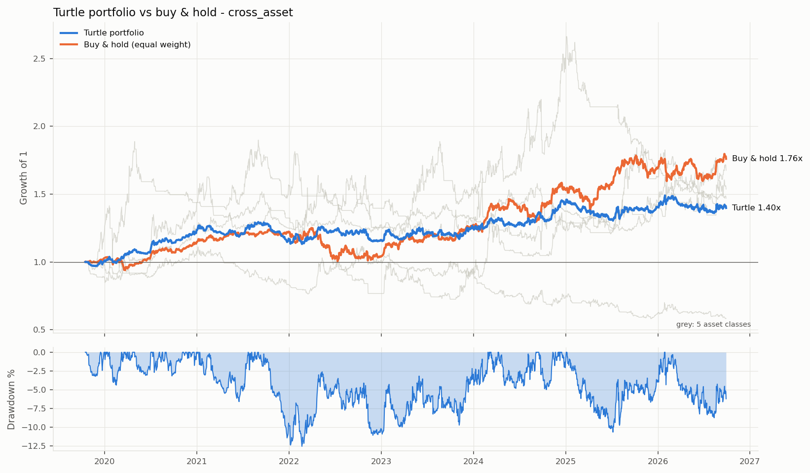
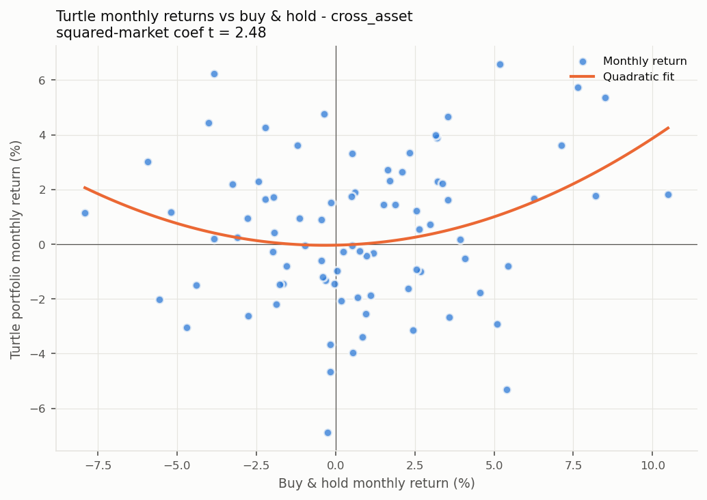

# 海龟交易系统 — 跨资产组合回测报告

> 生成时间: 2026-09-28 18:52  
> 系统: 系统2 (60/20) | 起始: 2019-01-01 | 组合方式: 各类别内等权, 再类别间等权  
> 期货: 新浪单月合约自拼复权连续 (diff), 每品种本金 10,000,000, 滑点 3‱  
> 汇率: 东方财富日线, 滑点 1‱, 不含利差 (carry)  
> 权益逐根盯市; 止损跳空按开盘价; 信号用复权价, 盈亏按真实价格  
> 波动率缩放: 单品种先缩放到 40% (论文做法); 组合缩放到 10% 目标波动 (事前 EWMA 估计, 杠杆上限 10 倍)

---

## 一、各品种表现

| 类别 | 品种 | 起始 | 交易 | 年化% | 年化波动% | 夏普 | PF | 最大回撤% | Calmar | 持仓占比% |
|---|---|---|---:|---:|---:|---:|---:|---:|---:|---:|
| 股指 | IF | 2019-04-08 | 30 | +1.8 | 9.6 | 0.23 | 1.34 | -14.8 | 0.12 | 47 |
| 股指 | IH | 2019-04-08 | 26 | -0.6 | 9.3 | -0.02 | 0.88 | -22.7 | -0.03 | 46 |
| 股指 | IC | 2019-04-08 | 27 | +0.5 | 9.1 | 0.10 | 1.12 | -16.9 | 0.03 | 47 |
| 股指 | IM | 2022-10-26 | 12 | +4.7 | 9.5 | 0.53 | 3.24 | -11.8 | 0.40 | 53 |
| 国债 | T | 2019-04-08 | 26 | +3.7 | 9.1 | 0.44 | 1.63 | -20.7 | 0.18 | 53 |
| 国债 | TF | 2019-04-08 | 23 | +5.1 | 9.6 | 0.56 | 2.05 | -15.2 | 0.33 | 53 |
| 国债 | TS | 2019-05-09 | 25 | +0.3 | 9.1 | 0.08 | 1.06 | -19.5 | 0.02 | 49 |
| 国债 | TL | 2023-07-25 | 13 | +6.0 | 11.1 | 0.58 | 1.77 | -21.5 | 0.28 | 52 |
| 商品 | RB | 2019-04-08 | 30 | -1.5 | 8.8 | -0.13 | 0.73 | -22.8 | -0.07 | 50 |
| 商品 | I | 2019-04-08 | 30 | +0.1 | 8.3 | 0.06 | 1.02 | -27.6 | 0.00 | 47 |
| 商品 | CU | 2019-04-08 | 31 | +2.2 | 11.6 | 0.25 | 1.33 | -25.4 | 0.09 | 41 |
| 商品 | AL | 2019-04-08 | 30 | +1.1 | 10.8 | 0.15 | 1.18 | -25.6 | 0.04 | 47 |
| 商品 | AU | 2019-04-08 | 23 | +10.3 | 15.4 | 0.71 | 4.01 | -21.6 | 0.48 | 55 |
| 商品 | AG | 2019-04-08 | 30 | +5.5 | 18.4 | 0.38 | 1.96 | -36.0 | 0.15 | 41 |
| 商品 | SC | 2019-04-08 | 30 | +1.6 | 11.6 | 0.19 | 1.34 | -18.5 | 0.09 | 48 |
| 商品 | TA | 2019-04-08 | 25 | +5.6 | 11.8 | 0.52 | 2.45 | -15.8 | 0.36 | 53 |
| 商品 | MA | 2019-04-08 | 38 | -6.1 | 8.6 | -0.69 | 0.26 | -38.7 | -0.16 | 45 |
| 商品 | M | 2019-04-08 | 27 | +2.6 | 9.0 | 0.33 | 1.58 | -18.4 | 0.14 | 48 |
| 商品 | Y | 2019-04-08 | 26 | +2.8 | 8.6 | 0.36 | 1.55 | -19.9 | 0.14 | 48 |
| 商品 | CF | 2019-04-08 | 28 | +6.2 | 10.3 | 0.64 | 2.48 | -11.8 | 0.53 | 56 |
| 商品 | SR | 2019-04-08 | 34 | -4.8 | 7.1 | -0.65 | 0.35 | -32.6 | -0.15 | 40 |
| 汇率 | USDCNH | 2019-03-29 | 26 | +8.3 | 10.5 | 0.81 | 3.60 | -13.6 | 0.61 | 61 |
| 汇率 | EURUSD | 2019-03-29 | 39 | -4.9 | 7.0 | -0.69 | 0.33 | -31.9 | -0.15 | 44 |
| 汇率 | USDJPY | 2019-03-29 | 40 | -3.1 | 8.9 | -0.31 | 0.57 | -22.0 | -0.14 | 50 |
| 汇率 | AUDUSD | 2019-03-29 | 38 | -4.8 | 7.8 | -0.59 | 0.38 | -39.4 | -0.12 | 46 |
| 汇率 | GBPUSD | 2019-03-29 | 35 | -3.4 | 7.5 | -0.42 | 0.48 | -32.7 | -0.10 | 49 |
| 加密 | BTC | 2022-03-04 | 24 | +4.3 | 11.1 | 0.43 | 1.76 | -12.0 | 0.36 | 52 |
| 加密 | ETH | 2022-03-04 | 22 | +6.8 | 12.3 | 0.59 | 2.84 | -15.4 | 0.44 | 60 |

---

## 二、各资产类别表现 (类别内品种等权)

| 类别 | 品种数 | 年化收益% | 年化波动% | 夏普 | 最大回撤% | Calmar |
|---|---:|---:|---:|---:|---:|---:|
| 股指 | 4 | +5.2 | 27.2 | 0.32 | -35.2 | 0.15 |
| 国债 | 4 | +6.9 | 25.4 | 0.39 | -43.8 | 0.16 |
| 商品 | 13 | +4.5 | 12.7 | 0.41 | -22.3 | 0.20 |
| 汇率 | 5 | -8.2 | 18.8 | -0.36 | -49.4 | -0.17 |
| 加密 | 2 | +9.3 | 26.3 | 0.47 | -29.2 | 0.32 |
| **组合 (全样本)** | 28 | **+4.7** | **11.0** | **0.47** | **-13.7** | **0.34** |
| **组合 (全部类别到齐后, 2022-06-22 起)** | 28 | **+2.7** | **10.0** | **0.32** | **-9.8** | **0.27** |

各类别开始时间: 股指 2019-11-28, 国债 2019-08-23, 商品 2019-07-24, 汇率 2019-08-07, 加密 2022-06-22。开始时间不同时, 早期的"组合"只由已有数据的类别构成。

**类别之间的相关性** (策略日收益):

| | 股指 | 国债 | 商品 | 汇率 | 加密 |
|---|---:|---:|---:|---:|---:|
| 股指 | 1.00 | -0.08 | 0.10 | 0.04 | 0.02 |
| 国债 | -0.08 | 1.00 | -0.00 | -0.03 | 0.02 |
| 商品 | 0.10 | -0.00 | 1.00 | 0.07 | 0.01 |
| 汇率 | 0.04 | -0.03 | 0.07 | 1.00 | 0.06 |
| 加密 | 0.02 | 0.02 | 0.01 | 0.06 | 1.00 |

品种两两相关性平均: **类内 0.20**, **跨类 0.01**。跨类相关性越低, 跨资产分散化降低组合波动的效果越好 (对照 TSMOM 论文 Table 4)。

---

## 组合目标波动率: 10%

组合原本的波动率很低 (品种多且相关性低), 期货和永续合约只需保证金, 实际中会加杠杆把组合调到目标波动率。夏普基本不变, 收益和回撤同比例放大。

| 组合 | 年化收益% | 年化波动% | 夏普 | 最大回撤% | Calmar | 平均杠杆 | 最高杠杆 |
|---|---:|---:|---:|---:|---:|---:|---:|
| 原始 | +4.7 | 11.0 | 0.47 | -13.7 | 0.34 | 1.0 | 1.0 |
| 缩放到 10% | +4.9 | 9.7 | 0.54 | -12.6 | 0.39 | 0.9 | 1.5 |

缩放从 2019-10-17 开始 (前 60 个交易日用于估计波动率)。以下压力时期和组合分析均使用缩放后的组合。

---

## 三、压力时期表现

| 时期 | 区间 | 海龟组合 | 等权买入持有 | 股指类 (海龟) | 当时有数据的类别 |
|---|---|---:|---:|---:|---|
| 2020 疫情冲击 | 2020-01-20 ~ 2020-03-23 | +3.9% | -9.0% | -32.4% | 股指, 国债, 商品, 汇率 |
| 2022 全球加息 | 2022-01-01 ~ 2022-10-31 | +5.8% | -14.4% | +23.8% | 股指, 国债, 商品, 汇率, 加密 |
| 2024 年初小盘股下跌 | 2024-01-02 ~ 2024-02-05 | +2.1% | -4.1% | +26.1% | 股指, 国债, 商品, 汇率, 加密 |

日期为大致区间, 仅用于观察趋势策略在危机中的表现。

---

## 四、组合表现与风险特征

#### 组合表现 (跨资产 系统2 (60/20); 5 个资产类别、28 个品种, 2019-10-17 ~ 2026-09-28)

| 指标 | 海龟组合 | 基准: 等权买入持有 |
|---|---:|---:|
| 年化收益 % | +4.9 | +8.4 |
| 年化波动 % | 9.7 | 11.6 |
| 夏普 | 0.54 | 0.75 |
| Sortino | 0.72 | 1.02 |
| 最大回撤 % | -12.6 | -19.7 |
| Calmar | 0.39 | 0.43 |

跨类别品种两两相关性平均: 0.01  (越低, 分散化降波动的效果越好)

| 年份 | 海龟组合 | 等权持有 |
|---|---:|---:|
| 2019 | +1.0% | +2.8% |
| 2020 | +22.3% | +11.6% |
| 2021 | -5.4% | +6.6% |
| 2022 | -0.6% | -15.0% |
| 2023 | +7.4% | +21.5% |
| 2024 | +15.1% | +21.1% |
| 2025 | -2.1% | +10.4% |
| 2026 | -0.5% | +4.2% |

#### 风险特征 (月度回归, 括号内为 Newey-West t 值)

| 回归 | α (月) | 基准收益 | 基准收益² | 基准波动率 | 高波动哑变量 | R² |
|---|---:|---:|---:|---:|---:|---:|
| CAPM | 0.36% (1.52) | 0.109 (1.02) | | | | 0.02 |
| Smile | | 0.024 (0.26) | 3.662 (2.48) | | | 0.08 |
| 波动率状态 | | | | -0.115 (-1.02) | 1.08% (0.99) | 0.01 |

样本 84 个月。读法:
- **CAPM α**: 月均 0.36% (年化约 4.3%), t = 1.52。不显著, 收益大部分可由被动做多解释。
- **Smile**: 基准收益平方项 t = 2.48。显著为正: 大涨大跌时都赚钱, 类似 TSMOM 的 smile。
- **波动率状态**: 基准波动率 t = -1.02, 高波动哑变量 t = 0.99。与市场波动率状态关系不显著 (这也说明按波动率择时的 GARCH 过滤器改善空间有限)。
- CAPM 的截距是 α (基准是可交易的等权持有组合); Smile 和波动率回归的截距没有 α 含义, 不报告。
- 高波动阈值用全样本 80% 分位数, 是描述性分析, 不能直接当交易规则。

