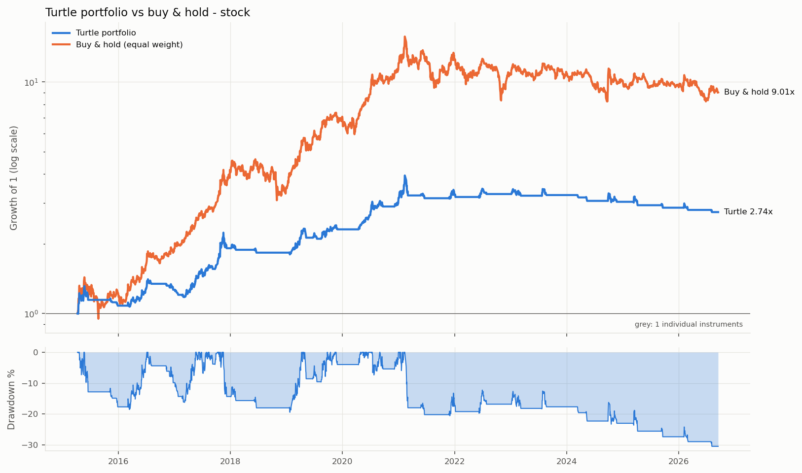
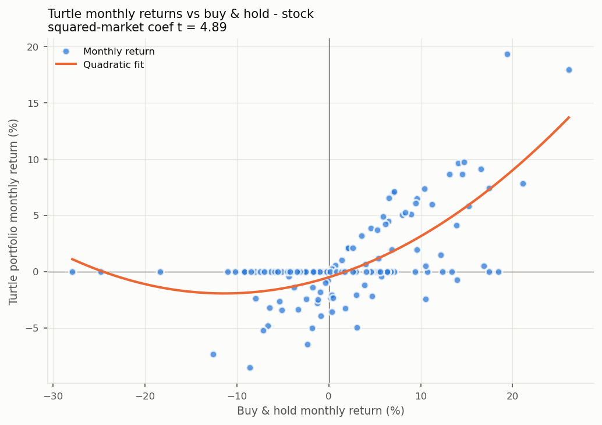

# 海龟交易系统 — A股回测报告

> 生成时间: 2026-09-28 17:32  
> 回测区间: 2015-01-01 ~ 今 | 数据来源: csmar  
> 初始资金: 1,000,000 | 仓位: 1% 资金/ATR | 止损: 2N  
> 手续费: 开 2.5‱ / 平 2.5‱ / 卖出印花税 5.0‱ | 滑点: 10.0‱/次 | 做空: 不允许 | 年化天数: 252  
> 权益逐根盯市 (回撤、夏普含持仓浮亏); 止损跳空时按开盘价成交

> A股数据: CSMAR 日个股回报率 (TRD_Dalyr); 信号用 Dretwd 累乘的复权价, 手数/费用用不复权收盘价 Clsprc  
> ⚠️ 文件只有收盘价 (无开高低) 时, 唐奇安通道与 ATR 均按收盘价计算, 止损也只在收盘时检查。

---

## 一、各品种明细

| 品种 | 周期 | 系统 | 交易 | 总收益% | 年化% | 年化波动% | 夏普 | 胜率% | PF | 回撤% | Calmar | 持仓占比% |
|---:|---:|---:|---:|---:|---:|---:|---:|---:|---:|---:|---:|---:|
| 600519 | 1d | 系统1 (20/10) | 66 | +215.0 | +10.8 | 15.6 | 0.73 | 34.8 | 1.73 | -29.1 | 0.371 | 38 |
| 600519 | 1d | 系统2 (60/20) | 31 | +174.2 | +9.6 | 14.2 | 0.71 | 35.5 | 2.77 | -30.5 | 0.314 | 35 |

---

## 二、跨品种横向对比

### 1d × 系统1 (20/10) (1 个品种)

| 品种 | 周期 | 系统 | 交易 | 总收益% | 年化% | 年化波动% | 夏普 | 胜率% | PF | 回撤% | Calmar | 持仓占比% |
|---:|---:|---:|---:|---:|---:|---:|---:|---:|---:|---:|---:|---:|
| 600519 | 1d | 系统1 (20/10) | 66 | +215.0 | +10.8 | 15.6 | 0.73 | 34.8 | 1.73 | -29.1 | 0.371 | 38 |
| **中位数** | | | | | +10.8 | | 0.73 | | 1.73 | -29.1 | 0.371 | |
| **均值** | | | | | +10.8 | | 0.73 | | 1.73 | -29.1 | 0.371 | |

盈利品种: 1/1 (100%)

### 1d × 系统2 (60/20) (1 个品种)

| 品种 | 周期 | 系统 | 交易 | 总收益% | 年化% | 年化波动% | 夏普 | 胜率% | PF | 回撤% | Calmar | 持仓占比% |
|---:|---:|---:|---:|---:|---:|---:|---:|---:|---:|---:|---:|---:|
| 600519 | 1d | 系统2 (60/20) | 31 | +174.2 | +9.6 | 14.2 | 0.71 | 35.5 | 2.77 | -30.5 | 0.314 | 35 |
| **中位数** | | | | | +9.6 | | 0.71 | | 2.77 | -30.5 | 0.314 | |
| **均值** | | | | | +9.6 | | 0.71 | | 2.77 | -30.5 | 0.314 | |

盈利品种: 1/1 (100%)

---

## 组合层面 (各品种等权, 参考 TSMOM 论文的 diversified 组合)

| 组合 | 品种数 | 年化收益% | 年化波动% | 夏普 | Sortino | 最大回撤% | Calmar | 平均相关性 |
|---|---:|---:|---:|---:|---:|---:|---:|---:|
| 基线 1d 系统1 (20/10) | 1 | +10.8 | 15.6 | 0.73 | 0.76 | -29.1 | 0.37 | nan |
| 基线 1d 系统2 (60/20) | 1 | +9.6 | 14.3 | 0.71 | 0.70 | -30.5 | 0.31 | nan |

### 基线: 1d × 系统2 (60/20)

#### 组合表现 (基线 1d 系统2 (60/20); 1 个品种等权, 2015-04-10 ~ 2026-09-14)

| 指标 | 海龟组合 | 基准: 等权买入持有 |
|---|---:|---:|
| 年化收益 % | +9.6 | +22.0 |
| 年化波动 % | 14.3 | 29.7 |
| 夏普 | 0.71 | 0.82 |
| Sortino | 0.70 | 1.29 |
| 最大回撤 % | -30.5 | -47.5 |
| Calmar | 0.31 | 0.46 |

品种间日收益平均相关性: nan  (越低, 分散化降波动的效果越好)

| 年份 | 海龟组合 | 等权持有 |
|---|---:|---:|
| 2015 | +8.1% | +22.1% |
| 2016 | +17.2% | +56.4% |
| 2017 | +51.0% | +111.9% |
| 2018 | -4.3% | -14.2% |
| 2019 | +26.1% | +103.5% |
| 2020 | +36.9% | +70.9% |
| 2021 | +3.2% | +3.5% |
| 2022 | +0.5% | -13.8% |
| 2023 | -1.0% | +2.6% |
| 2024 | -6.5% | -8.5% |
| 2025 | -5.7% | -6.3% |
| 2026 | -4.3% | -5.0% |

#### 风险特征 (月度回归, 括号内为 Newey-West t 值)

| 回归 | α (月) | 基准收益 | 基准收益² | 基准波动率 | 高波动哑变量 | R² |
|---|---:|---:|---:|---:|---:|---:|
| CAPM | 0.25% (1.06) | 0.285 (4.50) | | | | 0.37 |
| Smile | | 0.253 (6.91) | 1.112 (4.89) | | | 0.50 |
| 波动率状态 | | | | 0.170 (3.28) | -2.95% (-2.25) | 0.09 |

样本 138 个月。读法:
- **CAPM α**: 月均 0.25% (年化约 3.0%), t = 1.06。不显著, 收益大部分可由被动做多解释。
- **Smile**: 基准收益平方项 t = 4.89。显著为正: 大涨大跌时都赚钱, 类似 TSMOM 的 smile。
- **波动率状态**: 基准波动率 t = 3.28, 高波动哑变量 t = -2.25。策略收益与市场波动率状态有关。
- CAPM 的截距是 α (基准是可交易的等权持有组合); Smile 和波动率回归的截距没有 α 含义, 不报告。
- 高波动阈值用全样本 80% 分位数, 是描述性分析, 不能直接当交易规则。

